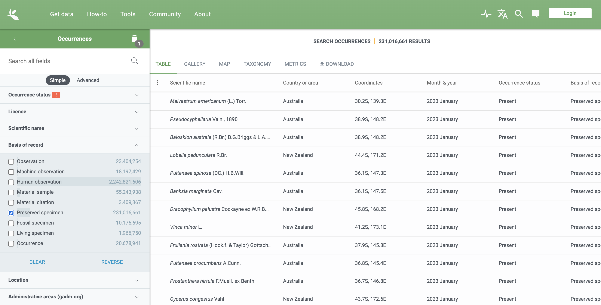
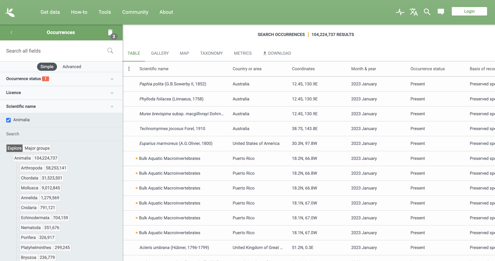
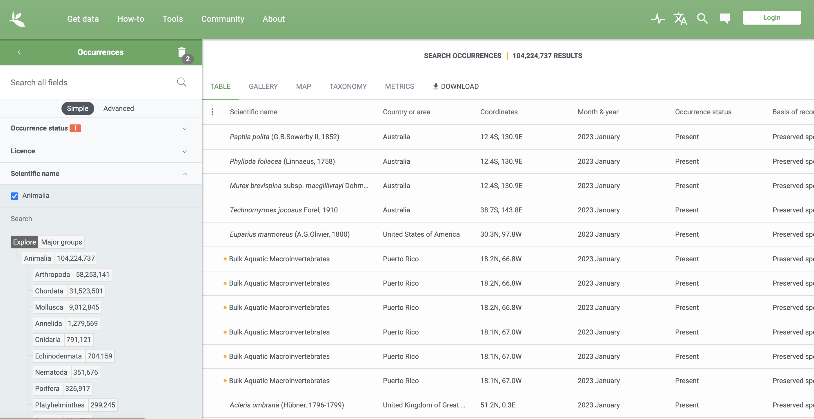
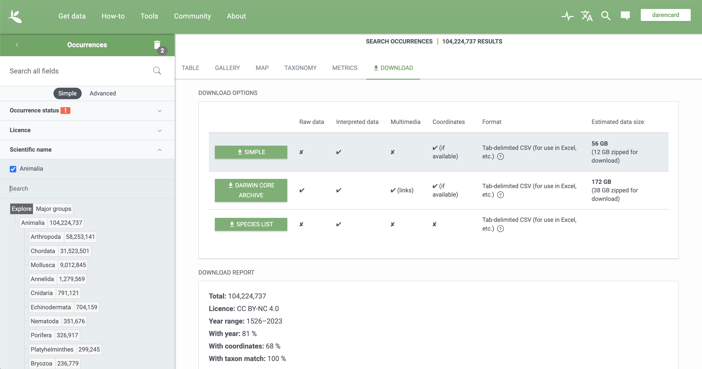
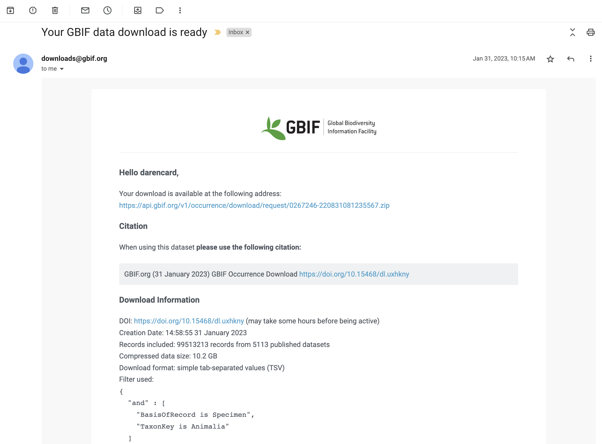

```{r setup, include=FALSE}
knitr::opts_chunk$set(echo = TRUE)
```

```{r 01-loadpkg, echo=FALSE, warnings=FALSE, message=FALSE}
# load necessary packages
library(tidyverse)
library(scales)
library(patchwork)
library(ggiraph)
library(maps)

# turn off scientific notation
options(scipen=999)
```

Note: This document is made interactive using R [Shiny](https://shiny.posit.co/). Certain elements of the document (especially plots) may take a moment to load or refresh, so please be patient.

# Summary

Natural history museums are vibrant institutions that play critical roles in modern research, education, and cultural outreach in the natural sciences and more broadly. However, despite centuries of existence and the emergence of major natural history museums across the globe, little is widely known about overall collections sizes and histories of growth. Gaps in such knowledge leave museum scientists ill-equipped to establish collecting and scientific priorities in museums and to advocate for funding and support for natural history collections. To help overcome this gap in knowledge, this report outlines the collection, analysis, and exploration of natural history museum collections growth in a reproducible manner.

```{r 02-load-datasets, echo=FALSE, warnings=FALSE, message=FALSE}
# load raw dataset as a dataframe to variable 'df'
df <- read.table("Animalia_0267246-220831081235567.phylum_class_collection_year_counts.txt",
                 header=FALSE, sep="\t", quote = "",
                 col.names=c("phylum", "class", "collection", "year", "count"))

# load key associating collections with institutions
collection_key <- read.table("Institution_codes_lookup_table.txt", 
                             header=TRUE, sep="\t", quote = "")
```

## Data Collecting & Processing

Data for this report was acquired from the [Global Biodiversity Information Facility (GBIF)](https://www.gbif.org/), an international network and data infrastructure aimed at providing anyone, anywhere, open access to data about all types of life on Earth. One nice thing about GBIF is that they care a lot about data availability and reproducibility, generating digital object identifiers (DOIs) for datasets retrieved from the GBIF database. On 2023-01-31, I retrieved a dataset of all records of 'preserved specimens' for the clade Animalia (animals). I have provided an overview of how I did this in the [Supplement](#Supplement) portion of this document, but the dataset I generated is openly available online via the DOI [10.15468/dl.uxhkny](https://doi.org/10.15468/dl.uxhkny), so feel free to download the dataset I already generated. Here is a full citation for the data.

GBIF.org (31 January 2023) GBIF Occurrence Download <https://doi.org/10.15468/dl.uxhkny>

Before we can move forward with data visualization and exploration, we need to do some data cleaning and processing. A full description of data cleaning and processing is included in the [Supplement](#Supplement) portion of this document. Briefly, the following actions were taken:

1. Any records where the phylum is blank or not defined or where the record was not identified down to the level of genus or below were removed.

2. Any records from outside the 1900 to 2015 timespan were removed.

3. Individual collections, identified by their standardized collection codes, were manually associated with the parent institution that publishes the catalog data. This is because the definition of a collection, or at least how records are stored and provided to GBIF, changes across museums or institutions. Some museums deposit all of their collections records to GBIF as a single collection, ignoring any potential subcollections (e.g., mammalogy, ornithology, etc.) at the institution, while others deposit subcollections to GBIF separately. Also, many of these collection codes are acronyms or abbreviations, which can make it difficult to interpret what collection one is looking at unless you are steeped in the world of museums and know all of these codes. Ideally, we would include a full museum or institution name and associating collections with publishing institutions addresses this issue.

4. We will focus only on records from animal phyla that are well-represented across the dataset, applying two filters to meet this objective. First, phyla where there are at least 5,000 records across the dataset will be retained. Second, at least 100 records from a given phylum must have been collected in at least 50 of the years between 1900 and 2015.

5. We will also focus only on records from large institutions (*not* collections) that were regularly contributed to between 1900 and 2015, applying two filters to meet this objective. First, institutions larger than 100,000 filtered records will be retained. Second, at least 100 records from a given institution must have been collected in at least 50 of the years between 1900 and 2015.

```{r 03-summary-filter-data, echo=FALSE, warnings=FALSE, message=FALSE, fig.width = 10}
# create table of total sizes of clades (based on collections between 1900 and 2015)
clade_counts <- df %>%
    filter(year >= 1900 & year <= 2015) %>%
    filter(phylum != "" |
           class != "") %>%
    group_by(phylum) %>%
    summarize(sum = sum(count)) %>%
    arrange(desc(sum))

# create table of annual counts of clades (based on collections between 1900 and 2015)
clade_year_counts <- df %>% 
  filter(phylum != "" |
         class != "") %>%
  filter(year >= 1900 & year <= 2015) %>% 
  filter(count >= 100) %>% 
  group_by(phylum, year) %>% 
  summarize(count = n()) %>% 
  group_by(phylum) %>%
  summarize(year_count = n()) %>%
  ungroup()

# create table of total sizes of institutions (based on collections between 1900 and 2015)
institution_counts <- left_join(collection_key, df, 
                                by=c("Institution.Codes" = "collection")) %>%
  filter(phylum != "" |
         class != "") %>%
  filter(year >= 1900 & year <= 2015) %>%
  group_by(Publisher.Institution) %>%
  summarize(sum = sum(count)) %>%
  arrange(desc(sum))

# create table of annual counts of institutions (based on collections between 1900 and 2015)
institution_year_counts <- left_join(df, collection_key, by=c("collection" = "Institution.Codes")) %>%
  left_join(., institution_counts) %>%
  filter(phylum != "" |
         class != "") %>%
  filter(year >= 1900 & year <= 2015) %>% 
  filter(count >= 100) %>% 
  group_by(Publisher.Institution, year) %>% 
  summarize(count = n()) %>% 
  group_by(Publisher.Institution) %>%
  summarize(year_count = n()) %>%
  ungroup()

# phyla with >= 5k records
high_count_phyla <- clade_counts %>% 
  filter(sum >= 5000) %>% 
  pull(phylum)

# phyla are consistently collected during timespan
# at least 50 years meet criterion between 1900 and 2015
clade_high_count_years <- clade_year_counts %>% 
  filter(year_count >= 50) %>% 
  pull(phylum)

# redefine large collections as collections with >= 100k records
high_count_institutions <- institution_counts %>%
  filter(sum >= 100000) %>%
  pull(Publisher.Institution)

# institutions are consistently contributed to during timespan
# at least 100 years meet criterion between 1900 and 2015
institution_high_count_years <- institution_year_counts %>% 
  filter(year_count >= 50) %>% 
  pull(Publisher.Institution)

# merge datasets and apply filters  
filteredDF <- left_join(df, collection_key,
                        by=c("collection" = "Institution.Codes")) %>%
  left_join(., institution_counts) %>%
  filter(phylum != "" &
         class != "") %>%
  filter(year >= 1900 & year <= 2015) %>%
  filter(phylum %in% high_count_phyla) %>%
  filter(phylum %in% clade_high_count_years) %>%
  filter(Publisher.Institution %in% high_count_institutions) %>%
  filter(Publisher.Institution %in% institution_high_count_years)
```

Given there are major differences in how collections accumulate cataloged specimens, it is difficult to compare counts of specimens alone. Therefore, counts have been standardized so they are comparable by dividing the count of records per year and per phylum by the total number of records in the phylum over the time period of interested (1900 to 2015), resulting in a standardized measure of the proportion of the total records for a phylum that is collected in each year.

```{r 04-summary-standardize-data, echo=FALSE, warnings=FALSE, message=FALSE, fig.width = 10}
# standardize data while ignoring class
standardizedFilteredDF <- filteredDF %>%
  group_by(phylum, Publisher.Institution, 
           Country, Country.Code, Continent, year, sum) %>%
  summarize(count = sum(count)) %>%
  mutate(prop = count / sum,
         perc = (count / sum) * 100) %>%
  ungroup()

names(standardizedFilteredDF) <- c("Phylum", "Institution", "Country", 
                                   "Country Code", "Continent", "Year", 
                                   "Sum", "Count", "Proportion", "Percentage")

# standardize data while including class
# for summarizing number/identity of classes below
classStandardizedFilteredDF <- filteredDF %>%
  group_by(phylum, class, Publisher.Institution, 
           Country, Country.Code, Continent, year, sum) %>%
  summarize(count = sum(count)) %>%
  mutate(class_prop = count / sum,
         class_perc = (count / sum) * 100) %>%
  ungroup()

names(classStandardizedFilteredDF) <- c("Phylum", "Class", "Institution", 
                                        "Country", "Country Code", 
                                        "Continent", "Year", "Sum", 
                                        "Count", "Proportion", "Percentage")
```

## Data Summary

The final dataset included a total of `r standardizedFilteredDF %>% pull(Phylum) %>% unique() %>% length()` phyla and `r classStandardizedFilteredDF %>% pull(Class) %>% unique() %>% length()` classes. Here are tables summarizing the data for these phyla and classes.

```{r 05-summary-taxonomy, echo=FALSE, warnings=FALSE, message=FALSE, fig.width = 5}
# summary table of phyla in dataset
phylumA <- classStandardizedFilteredDF %>%
  mutate_if(is.character, as.factor) %>%
  group_by(Phylum, Class) %>%
  count(Class) %>%
  group_by(Phylum) %>%
  count()

phylumB <- classStandardizedFilteredDF %>%
  mutate_if(is.character, as.factor) %>%
  group_by(Phylum, Institution) %>%
  count(Institution) %>%
  group_by(Phylum) %>%
  count()

phylumC <- classStandardizedFilteredDF %>%
  mutate_if(is.character, as.factor) %>%
  group_by(Phylum, Country) %>%
  count(Country) %>%
  group_by(Phylum) %>%
  count()

phylumD <- classStandardizedFilteredDF %>%
  mutate_if(is.character, as.factor) %>%
  group_by(Phylum, Continent) %>%
  count(Continent) %>%
  group_by(Phylum) %>%
  count()

phylumE <- classStandardizedFilteredDF %>%
  mutate_if(is.character, as.factor) %>%
  group_by(Phylum) %>%
  summarize(count = sum(Count)) %>%
  mutate(across(count, scales::label_comma()))

phylumSumm <- reduce(list(phylumA,phylumB,phylumC,phylumD,phylumE),
                     dplyr::left_join, by = "Phylum") %>%
  ungroup()

names(phylumSumm) <- c("Phylum", "Number of Classes",
                       "Number of Institutions", "Number of Countries",
                       "Number of Continents", "Number of Records")

renderDataTable(phylumSumm)

# summary table of classes in dataset
classA <- classStandardizedFilteredDF %>%
  mutate_if(is.character, as.factor) %>%
  group_by(Phylum, Class, Institution) %>%
  count(Institution) %>%
  group_by(Phylum, Class) %>%
  count()

classB <- classStandardizedFilteredDF %>%
  mutate_if(is.character, as.factor) %>%
  group_by(Phylum, Class, Country) %>%
  count(Country) %>%
  group_by(Phylum, Class) %>%
  count()

classC <- classStandardizedFilteredDF %>%
  mutate_if(is.character, as.factor) %>%
  group_by(Phylum, Class, Continent) %>%
  count(Continent) %>%
  group_by(Phylum, Class) %>%
  count()

classD <- classStandardizedFilteredDF %>%
  mutate_if(is.character, as.factor) %>%
  group_by(Phylum, Class) %>%
  summarize(count = sum(Count)) %>%
  mutate(across(count, scales::label_comma()))

classSumm <- reduce(list(classA,classB,classC,classD),
                    dplyr::left_join, by = c("Phylum", "Class")) %>%
  ungroup()

names(classSumm) <- c("Phylum", "Class",
                      "Number of Institutions", "Number of Countries",
                      "Number of Continents", "Number of Records")

renderDataTable(classSumm)
```

Records in the final dataset came from `r standardizedFilteredDF %>% pull(Institution) %>% unique() %>% length()` institutions from across `r standardizedFilteredDF %>% pull(Country) %>% unique() %>% length()` countries and all `r standardizedFilteredDF %>% pull(Continent) %>% unique() %>% length()` continents. Here are tables summarizing the data for these institutions, countries, and continents.

```{r 06-summary-collections, echo=FALSE, warnings=FALSE, message=FALSE, fig.width = 5}
# summary table of institutions in dataset
institutionA <- classStandardizedFilteredDF %>%
  mutate_if(is.character, as.factor) %>%
  group_by(Institution) %>%
  count(Phylum) %>%
  group_by(Institution) %>%
  count()

institutionB <- classStandardizedFilteredDF %>%
  mutate_if(is.character, as.factor) %>%
  group_by(Institution) %>%
  count(Class) %>%
  group_by(Institution) %>%
  count()

institutionC <- classStandardizedFilteredDF %>%
  mutate_if(is.character, as.factor) %>%
  group_by(Institution) %>%
  summarize(count = sum(Count)) %>%
  mutate(across(count, scales::label_comma()))

institutionSumm <- reduce(list(institutionA,institutionB,institutionC),
                          dplyr::left_join, by = c("Institution")) %>%
  ungroup()

names(institutionSumm) <- c("Institution", "Number of Phyla",
                            "Number of Classes", "Number of Records")

renderDataTable(institutionSumm)

# summary table of countries with institutions in dataset
countryA <- classStandardizedFilteredDF %>%
  mutate_if(is.character, as.factor) %>%
  group_by(Country) %>%
  count(Institution) %>%
  group_by(Country) %>%
  count()

countryB <- classStandardizedFilteredDF %>%
  mutate_if(is.character, as.factor) %>%
  group_by(Country) %>%
  count(Phylum) %>%
  group_by(Country) %>%
  count()

countryC <- classStandardizedFilteredDF %>%
  mutate_if(is.character, as.factor) %>%
  group_by(Country) %>%
  count(Class) %>%
  group_by(Country) %>%
  count()

countryD <- classStandardizedFilteredDF %>%
  mutate_if(is.character, as.factor) %>%
  group_by(Country) %>%
  summarize(count = sum(Count)) %>%
  mutate(across(count, scales::label_comma()))

countrySumm <- reduce(list(countryA,countryB,countryC,countryD),
                      dplyr::left_join, by = c("Country")) %>%
  ungroup()

names(countrySumm) <- c("Country", "Number of Institutions",
                        "Number of Phyla", "Number of Classes",
                        "Number of Records")

renderDataTable(countrySumm)

# summary table of continents with institutions in dataset
continentA <- classStandardizedFilteredDF %>%
  mutate_if(is.character, as.factor) %>%
  group_by(Continent) %>%
  count(Country) %>%
  group_by(Continent) %>%
  count()

continentB <- classStandardizedFilteredDF %>%
  mutate_if(is.character, as.factor) %>%
  group_by(Continent) %>%
  count(Institution) %>%
  group_by(Continent) %>%
  count()

continentC <- classStandardizedFilteredDF %>%
  mutate_if(is.character, as.factor) %>%
  group_by(Continent) %>%
  count(Phylum) %>%
  group_by(Continent) %>%
  count()

continentD <- classStandardizedFilteredDF %>%
  mutate_if(is.character, as.factor) %>%
  group_by(Continent) %>%
  count(Class) %>%
  group_by(Continent) %>%
  count()

continentE <- classStandardizedFilteredDF %>%
  mutate_if(is.character, as.factor) %>%
  group_by(Continent) %>%
  summarize(count = sum(Count)) %>%
  mutate(across(count, scales::label_comma()))

continentSumm <- reduce(list(continentA,continentB,continentC,continentD,continentE),
                        dplyr::left_join, by = c("Continent")) %>%
  ungroup()

names(continentSumm) <- c("Continent", "Number of Countries",
                          "Number of Institutiosn", "Number of Phyla",
                          "Number of Classes", "Number of Records")

renderDataTable(continentSumm)
```

Here is an interactive map showing the geographic extent of the institutions included in the final dataset, which each country colored by the density of institutions. You can hover over each country to see a count and full list of institutions. You can use the controls in the bottom-right corner to zoom and pan as needed (e.g., to visualize the countries in Europe).

```{r 07-summary-map, echo=FALSE, warnings=FALSE, message=FALSE, fig.width = 10}
# gather institution counts
institutionCounts <- standardizedFilteredDF %>%
  group_by(Country) %>%
  summarize(Count = n_distinct(Institution),
            museList = paste(unique(Institution), collapse="; "))

# render output using ggiraph
renderGirafe({
  world <- map_data("world")
  
  # replace with "United Kingdom" so it matches the museum data
  world$region[world$region == "UK"] <- "United Kingdom"

  # merge world data with museum data and plot as a map w/ 
  # nations colored by density of museums
  myMapPlot <- world %>%
    merge(institutionCounts, by.x = "region", by.y = "Country", all.x = T) %>% 
    arrange(group, order) %>% 
    ggplot(aes(x = long, y = lat)) + 
      geom_polygon_interactive(aes(group = group, fill = Count,
                                   tooltip = sprintf("Country: %s
                                                     Count: %.0f
                                                     Museums: %s", 
                                                     region, 
                                                     Count,
                                                     museList)), 
                               color = "black", size=0.25) +
      scale_fill_viridis_c(na.value="gray90", trans = "log") +
      labs(x = "Longitude", y = "Latitude") +
      theme_bw(base_size=18) +
      theme(legend.position="none")
  
  # render ggiraph
  girafe(ggobj = myMapPlot)
})
```

# Results

Based on over 40 million records surviving quality filtering, several results were obtained. Globally, these data indicate a long period of collections growth beginning in 1900 and extending until the 1960s, followed by a period of growing and diminishing collecting activity through the present. Moreover, collections growth or activity has already peaked around 2000 and, as of 2015, the final year evaluated, is in steady decline.

```{r 08-summary-plot-temporal-trend, echo=FALSE, warnings=FALSE, message=FALSE, fig.width = 10}
# plot main result: temporal global collections growth
renderPlot({
  ggplot(standardizedFilteredDF, aes(x=Year, y=Proportion)) +
    geom_smooth(method="loess", span=0.1) +
    scale_x_continuous(breaks=seq(1900, 2015, 10)) +
    labs(x="Year",
         y="Annual Collection Contribution\n(Proportion of 1900-2015 collections)") +
    theme_bw(base_size=18) +
    theme(panel.grid=element_blank())
})
```

## Temporal Trendlines

But this overall data trend integrates over a lot of variation in trends at the level of individual geographic areas (continents and countries), institutions, and taxonomic levels. The following interactive dashboard, built using `shiny` and `ggiraph`, will allow interested users to explore the underlying data in greater detail. Users can select the type of comparison they would like to make, whether that is between continents, countries, institutions, phyla, or classes. From there, the user can then select up to six data groupings (i.e., continents, countries, etc.) to visually compare, which should load in the following plot. Collections are sorted by the [three-letter ISO code](https://en.wikipedia.org/wiki/List_of_ISO_3166_country_codes) for their parent country and classes are sorted by phylum. The years slider can be used to focus on certain year ranges, although this option simply zooms into this range and does not recalculate the underlying proportions based on the new extent. The user may also choose to adjust the Loess smoothing to control how responsive the trendline(s) are to the underlying data. There is also an option to display the individual data points underlying the trends, although this is only recommended when comparing institutions due to the large amount of data available for other groupings (the plot will still render, but it will not be very useful to look at). Finally, there are additional options to customize the resulting plot, including log-scaling the y-axis, faceting the data groupings across subpanels, and allowing the subpanels y-axes to vary individually. There are also options in the bottom-right corner to adjust the view of the data by zooming, panning, etc. and when a user is happy with the plot they have produced, they can easily export the image to a PNG file for their own records. A rough plot title is constructed automatically from the user options, but the user can easily supply a custom title that helps with record keeping. Altogether, these options should allow interested users to visualize one or more aspects of the overall dataset and export useful plots for downstream uses.

```{r 09-interactive-temporal-trends, echo=FALSE, warnings=FALSE, message=FALSE, fig.width = 10, fig.height = 20}
# determine unique choices for each type of data
continent_choices <- classStandardizedFilteredDF %>%
  pull(Continent) %>%
  unique() %>%
  sort()

country_choices <- classStandardizedFilteredDF %>%
  pull(Country) %>%
  unique() %>%
  sort()

institution_choices <- classStandardizedFilteredDF %>%
  pull(Institution) %>%
  unique() %>%
  sort()

phylum_choices <- classStandardizedFilteredDF %>%
  pull(Phylum) %>%
  unique() %>%
  sort()

class_choices <- classStandardizedFilteredDF %>%
  pull(Class) %>%
  unique() %>%
  sort()

# construct an input panel to gather user options for trendline plot
inputPanel(
  textInput("title", label = "Title:"),
  
  radioButtons("plotChoiceTrend", label = "1. Select comparison type:",
               choices = c("Continents", "Countries", 
                           "Institutions", "Phyla",
                           "Classes")),
  
  selectizeInput("dataChoicesTrend", label = "2. Select data:",
                 choices = NULL, multiple = TRUE, 
                 selected = "Europe", 
                 options = list(maxItems = 6)),
  
  sliderInput("yearAdjustTrend", label = "Years:",
              min = 1900, max = 2015, value = c(1900, 2015), step = 1, sep = ""),
  
  # allow Loess span to be adjusted, since it can disappear when there are too few points
  # adjusting span up will recover line when too few points
  # could also try an approach outlined at https://stackoverflow.com/questions/46325323/how-to-make-geom-smooth-less-dynamic
  sliderInput("spanAdjust", label = "Loess span:",
              min = 0, max = 1, value = 0.25 , step = 0.05),
  
  checkboxInput("pointsDisplay", "Display data points?", FALSE),
  
  checkboxInput("logY", "Log scale y-axis?", FALSE),
  
  checkboxInput("facetCol", "Facet data by comparison type?", FALSE),
  
  checkboxInput("freeScales", "Variable scales on facet y-axes?", FALSE),
  
)

# function to select potential user options based on the selected comparison
# and the data series of interest
gatherUpdatedChoicesTrend <- function(comparison="Continents") {
  if (comparison == "Continents") {
    filterVar = "Continent"
  } else if (comparison == "Countries") {
    filterVar = "Country"
  } else if (comparison == "Institutions") {
    filterVar = "CCinstitution"
  } else if (comparison == "Phyla") {
    filterVar = "Phylum"
  } else if (comparison == "Classes") {
    filterVar = "Class"
  } else {
    print("Error!")
  }
  
  # filter based on the variable of interest and extract
  myChoicesTrend <- classStandardizedFilteredDF %>%
    unite(`Country Code`, Institution, col="CCinstitution", sep=": ") %>%
    rename(class = Class) %>%
    unite(Phylum, class, col="Class", sep="/", remove=FALSE) %>%
    pull(filterVar) %>%
    unique() %>%
    sort()
  
  return(myChoicesTrend)
}

# monitor input for plot choice and update data choice elements based on
# input selection using above `gatherUpdatedChoicesTrend` function
# from https://community.rstudio.com/t/dropdown-options-based-on-another-widget/49318/2
# more guideance: https://groups.google.com/g/shiny-discuss/c/vd_nB-BH8sw
observeEvent(input$plotChoiceTrend,
             {
                 # Use this function to update the choices for the user.
                 # First argument is session, next the input to update,
                 # and third the new choices. Here, I'm filtering the
                 # previously made data.frame to based on the column of interest,
                 # and returning the choices column.
                 updateSelectizeInput(session, input = "dataChoicesTrend",
                                      choices = gatherUpdatedChoicesTrend(input$plotChoiceTrend))
                 })

# color of points when moused over
css_default_hover <- girafe_css_bicolor(primary = "orange", secondary = "black")

# set some defaults for interactive plot
set_girafe_defaults(
  opts_hover = opts_hover(css = css_default_hover),
  opts_hover_inv = opts_hover_inv(css = "opacity:0.75;"),
  opts_zoom = opts_zoom(min = 1, max = 5),
  opts_tooltip = opts_tooltip(css = "padding:3px;background-color:#333333;color:white;"),
  opts_sizing = opts_sizing(rescale = TRUE),
  opts_toolbar = opts_toolbar(saveaspng = TRUE, 
                              position = "bottomright", 
                              delay_mouseout = 2500)
)

# create ggiraph plot
renderGirafe({
  # filter data and build main plot differently depending on plot choice
  if (input$plotChoiceTrend == "Continents") {
    myPlot <- classStandardizedFilteredDF %>%
      unite(`Country Code`, Institution, col="CCinstitution", sep=": ") %>%
      group_by(Phylum, CCinstitution, Country, Continent, Year, Sum) %>%
      summarize(Count = sum(Count),
                Proportion = sum(Proportion),
                Percentage = sum(Percentage)) %>%
      ungroup() %>% 
      mutate(Clade = Phylum) %>%
      filter(Continent %in% input$dataChoicesTrend) %>%
      filter(Year >= input$yearAdjustTrend[1] & Year < input$yearAdjustTrend[2]) %>%
      ggplot(aes(x=Year, y=Proportion, 
                 color=Continent, 
                 tooltip=Continent, 
                 data_id=Continent))
  } else if (input$plotChoiceTrend == "Countries") {
    myPlot <- classStandardizedFilteredDF %>%
      unite(`Country Code`, Institution, col="CCinstitution", sep=": ") %>%
      group_by(Phylum, CCinstitution, Country, Continent, Year, Sum) %>%
      summarize(Count = sum(Count),
                Proportion = sum(Proportion),
                Percentage = sum(Percentage)) %>%
      ungroup() %>%
      mutate(Clade = Phylum) %>%
      filter(Country %in% input$dataChoicesTrend) %>%
      filter(Year >= input$yearAdjustTrend[1] & Year < input$yearAdjustTrend[2]) %>%
      ggplot(aes(x=Year, y=Proportion, 
                 color=Country, 
                 tooltip=Country, 
                 data_id=Country))
  } else if (input$plotChoiceTrend == "Institutions") {
    myPlot <- classStandardizedFilteredDF %>%
      unite(`Country Code`, Institution, col="CCinstitution", sep=": ") %>%
      group_by(Phylum, CCinstitution, Country, Continent, Year, Sum) %>%
      summarize(Count = sum(Count),
                Proportion = sum(Proportion),
                Percentage = sum(Percentage)) %>%
      ungroup() %>%
      mutate(Clade = Phylum) %>%
      filter(CCinstitution %in% input$dataChoicesTrend) %>%
      filter(Year >= input$yearAdjustTrend[1] & Year < input$yearAdjustTrend[2]) %>%
      ggplot(aes(x=Year, y=Proportion, 
                 color=CCinstitution, 
                 tooltip=CCinstitution, 
                 data_id=CCinstitution))
  } else if (input$plotChoiceTrend == "Phyla") {
    myPlot <- classStandardizedFilteredDF %>%
      unite(`Country Code`, Institution, col="CCinstitution", sep=": ") %>%
      group_by(Phylum, CCinstitution, Country, Continent, Year, Sum) %>%
      summarize(Count = sum(Count),
                Proportion = sum(Proportion),
                Percentage = sum(Percentage)) %>%
      ungroup() %>%
      mutate(Clade = Phylum) %>%
      filter(Phylum %in% input$dataChoicesTrend) %>%
      filter(Year >= input$yearAdjustTrend[1] & Year < input$yearAdjustTrend[2]) %>%
      ggplot(aes(x=Year, y=Proportion, 
                 color=Phylum, 
                 tooltip=Phylum, 
                 data_id=Phylum))
  } else if (input$plotChoiceTrend == "Classes") {
    myPlot <- classStandardizedFilteredDF %>%
      unite(`Country Code`, Institution, col="CCinstitution", sep=": ") %>%
      unite(Phylum, Class, col="Clade", sep="/", remove=FALSE) %>%
      filter(Clade %in% input$dataChoicesTrend) %>%
      filter(Year >= input$yearAdjustTrend[1] & Year < input$yearAdjustTrend[2]) %>%
      ggplot(aes(x=Year, y=Proportion, 
                 color=Class, 
                 tooltip=Class, 
                 data_id=Class))
  } else {
    print("Error!")
  }
  
  # if user-specified title is provided, use that. Otherwise, construct simple default
  if (input$title == "") {
    myTitle = paste0(input$plotChoiceTrend,
                     ": ",
                     paste(input$dataChoicesTrend, collapse=" v. "))
  } else { 
    myTitle = input$title
  }
  
  # variable for Loess span
  mySpan = input$spanAdjust
  
  # if user specifies to have points displayed, add points and trendlines
  # otherwise, just add trendlines
  if (input$pointsDisplay == TRUE) {
    myPlot <- myPlot + 
      geom_smooth_interactive(method="loess", span=mySpan) +
      geom_point_interactive(aes(shape=Phylum, data_id=Phylum, 
                                 tooltip=sprintf("Clade: %s
                                                 Institution: %s
                                                 Year: %.0f
                                                 Proportion: %.5f
                                                 Count: %s", 
                                                 Clade, 
                                                 CCinstitution,
                                                 Year, 
                                                 Proportion,
                                                 comma(Count))),
                             alpha = 0.75) +
      geom_smooth_interactive(method="loess", span=mySpan, se=FALSE) +
      scale_x_continuous(breaks=seq(1900, 2015, 10)) + 
      scale_shape_manual_interactive(values=0:9) +
      labs(title=str_wrap(str_trunc(myTitle, 90, "right"), width=50),
           x="Year", 
           y="Annual Collection Contribution\n(Proportion of 1900-2015 collections)") +
      theme_bw() +
      theme(panel.grid=element_blank(),
            legend.position="none",
            axis.text.x=element_text(angle=45, vjust=1, hjust=1))
  } else {
    myPlot <- myPlot + 
      geom_smooth_interactive(method="loess", span=mySpan) +
      scale_x_continuous(breaks=seq(1900, 2015, 10)) + 
      scale_shape_manual_interactive(values=0:9) +
      scale_color_viridis_d() +
      labs(title=str_wrap(str_trunc(myTitle, 90, "right"), width=50),
           x="Year", 
           y="Annual Collection Contribution\n(Proportion of 1900-2015 collections)") +
      theme_bw() +
      theme(panel.grid=element_blank(),
            legend.position="none",
            axis.text.x=element_text(angle=45, vjust=1, hjust=1))
  }
  
  # if user specifies log10-scaling y-axis, make it so!
  if (input$logY == TRUE) {
    myPlot <- myPlot + scale_y_log10()
  }
  
  # if user specifies faceting by variable of interest, do so
  # must facet differently when user specifies free y-axis or not
  # must also facet differently for each plot choice
  if (input$facetCol == TRUE && input$freeScales == TRUE) {
    if (input$plotChoiceTrend == "Continents") {
      myPlot <- myPlot + facet_wrap(~Continent, ncol=2, scales="free_y")
    } else if (input$plotChoiceTrend == "Countries") {
      myPlot <- myPlot + facet_wrap(~Country, ncol=2, scales="free_y")
    } else if (input$plotChoiceTrend == "Institutions") {
      myPlot <- myPlot + facet_wrap(~CCinstitution, ncol=2, scales="free_y")
    } else if (input$plotChoiceTrend == "Phyla") {
      myPlot <- myPlot + facet_wrap(~Phylum, ncol=2, scales="free_y")
    } else if (input$plotChoiceTrend == "Classes") {
      myPlot <- myPlot + facet_wrap(~Class, ncol=2, scales="free_y")
    } else {
      print("Error!")
    }
  } else if (input$facetCol == TRUE && input$freeScales == FALSE) {
    if (input$plotChoiceTrend == "Continents") {
      myPlot <- myPlot + facet_wrap(~Continent, ncol=2)
    } else if (input$plotChoiceTrend == "Countries") {
      myPlot <- myPlot + facet_wrap(~Country, ncol=2)
    } else if (input$plotChoiceTrend == "Institutions") {
      myPlot <- myPlot + facet_wrap(~CCinstitution, ncol=2)
    } else if (input$plotChoiceTrend == "Phyla") {
      myPlot <- myPlot + facet_wrap(~Phylum, ncol=2)
    } else if (input$plotChoiceTrend == "Classes") {
      myPlot <- myPlot + facet_wrap(~Class, ncol=2)
    } else {
      print("Error!")
    }
  }

  # render ggiraph
  girafe(ggobj = myPlot)
  })
```

## Temporal Heatmaps

The trendline plots are quite informative to look at but they are limited in that beyond 5-10 data series, visualization becomes difficult. Therefore, we can use another visualization instead where data are binned into 5-year intervals. We are also binning the measure of collections growth and we use a heatmap plot to display collections growth (either proportions or counts). This type of plot has the advantage of being able to fit far more data on a single plot while maintaining the ability to see and interpret the data. Again, users can select the type of comparison they would like to make, whether that is between continents, countries, institutions, phyla, or classes. From there, the user can then select up to 25 data groupings (i.e., continents, countries, etc.) to visually compare, which should load in the following plot. Collections are sorted by the [three-letter ISO code](https://en.wikipedia.org/wiki/List_of_ISO_3166_country_codes) for their parent country and classes are sorted by phylum. The years slider can be used to focus on certain year ranges, although this option simply zooms into this range and does not recalculate the underlying proportions based on the new extent. The user is also able to switch between data visualizations where growth is displayed as proportions of the 1900 to 2015 total or as a raw count, both of which are interesting to visualize for different reasons. There is also a simple setting to arrange the y-axis data series either alphabetically or by the total size of the data series. As was the case with the interactive trend plot, there are also options in the bottom-right corner to adjust the view of the data by zooming, panning, etc. and when a user is happy with the plot they have produced, they can easily export the image to a PNG file for their own records. A rough plot title is constructed automatically from the user options, but the user can easily supply a custom title that helps with record keeping (recommended). Also please note that Institution names have been automatically abbreviated to aid in visualization since some are very long. Most abbreviated names remain interpretable, but below is a table relating these abbreviated names to the full Institution names, which can be used to identify a target Institution using the abbreviated name.

```{r 10-interactive-temporal-heat, echo=FALSE, warnings=FALSE, message=FALSE, fig.width = 10, fig.height = 30}
# gather table of phylum and class counts
phylum_counts <- filteredDF %>%
    filter(year < 2015) %>%
    group_by(phylum) %>%
    summarize(phylum_sum = sum(count))

class_counts <- filteredDF %>%
    filter(year < 2015) %>%
    group_by(phylum, class) %>%
    summarize(class_sum = sum(count))

# summarize phylum counts and bin counts/proportions accordingly
summPhylum <- left_join(filteredDF, phylum_counts) %>%
    filter(year < 2015) %>%
    mutate(year_bin = floor(year/5)*5) %>%
    group_by(phylum, year_bin, phylum_sum) %>%
    summarize(count = sum(count)) %>%
    mutate(prop = count / phylum_sum,
           perc = (count / phylum_sum) * 100) %>%
    mutate(prop_bin = factor(case_when(prop > 0.15 ~ ">0.15",
                                       prop > 0.10 ~ "0.10-0.15",
                                       prop > 0.05 ~ "0.05-0.10",
                                       prop > 0.01 ~ "0.01-0.05",
                                       TRUE ~ "<0.01"),
                             levels=c("<0.01", "0.01-0.05", "0.05-0.10",
                                      "0.10-0.15", ">0.15")),
           count_bin = factor(case_when(count > 1000000 ~ ">1M",
                                        count > 100000 ~ "100k-1M",
                                        count > 10000 ~ "10k-100k",
                                        count > 1000 ~ "1k-10k",
                                        TRUE ~ "<1k"),
                              levels=c("<1k", "1k-10k", "10k-100k",
                                       "100k-1M", ">1M"))) %>%
    mutate(clade=phylum) %>%
    ungroup() %>%
    mutate(clade_size=phylum_sum) %>%
    select(year_bin, phylum, clade, count, count_bin, clade_size, prop, prop_bin)

# summarize class counts and bin counts/proportions accordingly
summClass <- left_join(filteredDF, phylum_counts) %>%
    left_join(., class_counts) %>%
    filter(year < 2015) %>%
    mutate(year_bin = floor(year/5)*5) %>%
    group_by(phylum, class, year_bin, phylum_sum, class_sum) %>%
    summarize(count = sum(count)) %>%
    mutate(prop = count / class_sum,
           perc = (count / class_sum) * 100) %>%
    mutate(prop_bin = factor(case_when(prop > 0.15 ~ ">0.15",
                                       prop > 0.10 ~ "0.10-0.15",
                                       prop > 0.05 ~ "0.05-0.10",
                                       prop > 0.01 ~ "0.01-0.05",
                                       TRUE ~ "<0.01"),
                             levels=c("<0.01", "0.01-0.05", "0.05-0.10",
                                      "0.10-0.15", ">0.15")),
           count_bin = factor(case_when(count > 1000000 ~ ">1M",
                                        count > 100000 ~ "100k-1M",
                                        count > 10000 ~ "10k-100k",
                                        count > 1000 ~ "1k-10k",
                                        TRUE ~ "<1k"),
                              levels=c("<1k", "1k-10k", "10k-100k",
                                       "100k-1M", ">1M"))) %>%
    mutate(clade=paste(phylum, class, sep="/")) %>%
    ungroup() %>%
    mutate(clade_size=class_sum) %>%
    select(year_bin, phylum, clade, count, count_bin, clade_size, prop, prop_bin)

# gather table of institution counts and abbreviations
all_institutions <- filteredDF %>%
    filter(year < 2015) %>%
    group_by(Publisher.Institution) %>%
    summarize(institution_sum=sum(count)) %>%
    ungroup() %>%
    mutate(instAbbreviation = abbreviate(Publisher.Institution, 20, dot=TRUE))

# summarize institution counts and bin counts/proportions accordingly
summInstitution <- filteredDF %>%
    filter(year < 2015) %>%
    mutate(year_bin = floor(year/5)*5) %>%
    left_join(., all_institutions) %>%
    mutate(label=paste0(abbreviate(Publisher.Institution, 20, dot=TRUE),
                      " (N = ", comma(institution_sum), ")")) %>%
    group_by(Country.Code, Publisher.Institution, label, year_bin, institution_sum) %>%
    summarize(count = sum(count)) %>%
    mutate(prop = count / institution_sum,
           perc = (count / institution_sum) * 100) %>%
    mutate(prop_bin = factor(case_when(prop > 0.15 ~ ">0.15",
                                       prop > 0.10 ~ "0.10-0.15",
                                       prop > 0.05 ~ "0.05-0.10",
                                       prop > 0.01 ~ "0.01-0.05",
                                       TRUE ~ "<0.01"),
                             levels=c("<0.01", "0.01-0.05", "0.05-0.10",
                                      "0.10-0.15", ">0.15")),
           count_bin = factor(case_when(count > 1000000 ~ ">1M",
                                        count > 100000 ~ "100k-1M",
                                        count > 10000 ~ "10k-100k",
                                        count > 1000 ~ "1k-10k",
                                        TRUE ~ "<1k"),
                              levels=c("<1k", "1k-10k", "10k-100k",
                                       "100k-1M", ">1M"))) %>%
  unite(Country.Code, label, col="Institution", sep=": ", remove=FALSE) %>%
  ungroup()

# gather table of country counts
country_counts <- filteredDF %>%
    filter(year < 2015) %>%
    group_by(Country) %>%
    summarize(country_sum = sum(count)) %>%
    mutate(label=paste0(Country, " (N = ", comma(country_sum), ")"))

# summarize class counts and bin counts/proportions accordingly
summCountry <- left_join(filteredDF, country_counts) %>%
    filter(year < 2015) %>%
    mutate(year_bin = floor(year/5)*5) %>%
    group_by(Country, year_bin, country_sum) %>%
    summarize(count = sum(count)) %>%
    mutate(prop = count / country_sum,
           perc = (count / country_sum) * 100) %>%
    mutate(prop_bin = factor(case_when(prop > 0.15 ~ ">0.15",
                                       prop > 0.10 ~ "0.10-0.15",
                                       prop > 0.05 ~ "0.05-0.10",
                                       prop > 0.01 ~ "0.01-0.05",
                                       TRUE ~ "<0.01"),
                             levels=c("<0.01", "0.01-0.05", "0.05-0.10",
                                      "0.10-0.15", ">0.15")),
           count_bin = factor(case_when(count > 1000000 ~ ">1M",
                                        count > 100000 ~ "100k-1M",
                                        count > 10000 ~ "10k-100k",
                                        count > 1000 ~ "1k-10k",
                                        TRUE ~ "<1k"),
                              levels=c("<1k", "1k-10k", "10k-100k",
                                       "100k-1M", ">1M"))) %>%
  ungroup()

# gather table of continent counts
continent_counts <- filteredDF %>%
    filter(year < 2015) %>%
    group_by(Continent) %>%
    summarize(continent_sum = sum(count)) %>%
    mutate(label=paste0(Continent, " (N = ", comma(continent_sum), ")"))

# summarize class counts and bin counts/proportions accordingly
summContinent <- left_join(filteredDF, continent_counts) %>%
    filter(year < 2015) %>%
    mutate(year_bin = floor(year/5)*5) %>%
    group_by(Continent, year_bin, continent_sum) %>%
    summarize(count = sum(count)) %>%
    mutate(prop = count / continent_sum,
           perc = (count / continent_sum) * 100) %>%
    mutate(prop_bin = factor(case_when(prop > 0.15 ~ ">0.15",
                                       prop > 0.10 ~ "0.10-0.15",
                                       prop > 0.05 ~ "0.05-0.10",
                                       prop > 0.01 ~ "0.01-0.05",
                                       TRUE ~ "<0.01"),
                             levels=c("<0.01", "0.01-0.05", "0.05-0.10",
                                      "0.10-0.15", ">0.15")),
           count_bin = factor(case_when(count > 1000000 ~ ">1M",
                                        count > 100000 ~ "100k-1M",
                                        count > 10000 ~ "10k-100k",
                                        count > 1000 ~ "1k-10k",
                                        TRUE ~ "<1k"),
                              levels=c("<1k", "1k-10k", "10k-100k",
                                       "100k-1M", ">1M"))) %>%
  ungroup()

# dataframe of all potential combinations of variables of interest
# can be subsetted to select data options after selection plot options (see below)
selectionDF <- filteredDF %>%
  unite(Country.Code, Publisher.Institution, col="Institution", sep=": ") %>%
  unite(phylum, class, col="Class", sep="/", remove=FALSE) %>%
  rename(Phylum = phylum) %>%
  select(-c(class, collection, year, count, sum)) %>%
  distinct()

# construct an input panel to gather user options for heatmap plot
inputPanel(
  textInput("title", label = "Title:"),

  radioButtons("plotChoiceHeat", label = "1. Select comparison type:",
               choices = c("Continents", "Countries", "Institutions",
                           "Phyla", "Classes")),

  selectizeInput("dataChoicesHeat", label = "2. Select data:",
                 choices = NULL, multiple = TRUE,
                 options = list(maxItems = 25)),

  radioButtons("metricChoiceHeat", label = "3. Select proportions or counts:",
               choices = c("Proportions", "Counts")),
  
  sliderInput("yearAdjustHeat", label = "Years:",
              min = 1900, max = 2015, value = c(1900, 2015), step = 5, sep = ""),
  
  radioButtons("alphSize", label = "Order y-axis alphabetically or by size:",
               choices = c("Alphabetical", "Size")),

)

# function to select potential user options based on the selected comparison
# and the data series of interest
gatherUpdatedChoicesHeat <- function(comparison="Continents") {
  if (comparison == "Continents") {
    filterVar = "Continent"
  } else if (comparison == "Countries") {
    filterVar = "Country"
  } else if (comparison == "Institutions") {
    filterVar = "Institution"
  } else if (comparison == "Phyla") {
    filterVar = "Phylum"
  } else if (comparison == "Classes") {
    filterVar = "Class"
  } else {
    print("Error!")
  }

  myChoicesHeat <- selectionDF %>%
      pull(filterVar) %>%
      unique() %>%
      sort()

  return(myChoicesHeat)
}

# monitor input for plot choice and update data choice elements based on
# input selection using above `gatherUpdatedChoicesHeat` function
# from https://community.rstudio.com/t/dropdown-options-based-on-another-widget/49318/2
# more guideance: https://groups.google.com/g/shiny-discuss/c/vd_nB-BH8sw
observeEvent(input$plotChoiceHeat,
             {
                 # Use this function to update the choices for the user.
                 # First argument is session, next the input to update,
                 # and third the new choices. Here, I'm filtering the
                 # previously made data.frame to based on the series column,
                 # and returning the choices column.
                 # `drop=TRUE` makes it explicit that I want a vector returned.
                 updateSelectizeInput(session, input = "dataChoicesHeat",
                                      choices = gatherUpdatedChoicesHeat(input$plotChoiceHeat))
                 })

# create ggiraph plot
renderGirafe({
  
  # if user-specified title is provided, use that. Otherwise, construct simple default
  if (input$title == "") {
    myTitle = paste0(input$plotChoiceHeat,
                     ": ",
                     paste(input$dataChoicesHeat, collapse=" v. "))
  } else {
    myTitle = input$title
  }
  
  # filter data and build main plot differently depending on plot choice
  # also build separately based on whether user wants y-axis ordered 
  # alphabetically or by size
  if (input$plotChoiceHeat == "Continents") {
    if (input$alphSize == "Alphabetical") {
      myHeatPlot <- summContinent %>%
        mutate(label=paste0(Continent, " (N = ", comma(continent_sum), ")")) %>%
        filter(Continent %in% input$dataChoicesHeat) %>%
        filter(year_bin >= input$yearAdjustHeat[1] & year_bin < input$yearAdjustHeat[2]) %>%
        mutate(label=fct_rev(label)) %>%
        ggplot(aes(x=year_bin, y=label))
    } else if (input$alphSize == "Size") {
      myHeatPlot <- summContinent %>%
        mutate(label=paste0(Continent, " (N = ", comma(continent_sum), ")")) %>%
        filter(Continent %in% input$dataChoicesHeat) %>%
        filter(year_bin >= input$yearAdjustHeat[1] & year_bin < input$yearAdjustHeat[2]) %>%
        mutate(label=reorder(label, continent_sum)) %>%
        ggplot(aes(x=year_bin, y=label))
    # write "Error!" if problem - not expected (should do this a better way)
    } else {
      print("Error!")
    }
    
    # add geom_tile differently based on whether user selects data proportions or counts
    if (input$metricChoiceHeat == "Proportions") {
      myHeatPlot <- myHeatPlot +
      geom_tile_interactive(aes(fill=prop_bin, tooltip = sprintf("Bin start year: %s
                                                                  Continent: %s
                                                                  Proportion: %.5f
                                                                  Proportion bin: %s
                                                                  Count: %s
                                                                  Count bin: %s",
                                                                  year_bin,
                                                                  Continent,
                                                                  prop,
                                                                  prop_bin,
                                                                  comma(count),
                                                                  count_bin)),
                            color="black") +
      labs(title=str_wrap(str_trunc(myTitle, 90, "right"), width=50),
           x="Year (5-year bins)", 
           y="Continent", 
           fill="Proportion Bin")
    } else if (input$metricChoiceHeat == "Counts") {
      myHeatPlot <- myHeatPlot +
      geom_tile_interactive(aes(fill=count_bin, tooltip = sprintf("Bin start year: %s
                                                                  Continent: %s
                                                                  Proportion: %.5f
                                                                  Proportion bin: %s
                                                                  Count: %s
                                                                  Count bin: %s",
                                                                  year_bin,
                                                                  Continent,
                                                                  prop,
                                                                  prop_bin,
                                                                  comma(count),
                                                                  count_bin)),
                            color="black") +
      labs(title=str_wrap(str_trunc(myTitle, 90, "right"), width=50),
           x="Year (5-year bins)", 
           y="Continent", 
           fill="Count Bin")
    # write "Error!" if problem - not expected (should do this a better way)
    } else {
      print("Error!")
    }
  
  # filter data and build main plot differently depending on plot choice
  # also build separately based on whether user wants y-axis ordered 
  # alphabetically or by size
  } else if (input$plotChoiceHeat == "Countries") {
    if (input$alphSize == "Alphabetical") {
      myHeatPlot <- summCountry %>%
        mutate(label=paste0(Country, " (N = ", comma(country_sum), ")")) %>%
        filter(Country %in% input$dataChoicesHeat) %>%
        filter(year_bin >= input$yearAdjustHeat[1] & year_bin < input$yearAdjustHeat[2]) %>%
        mutate(label=fct_rev(label)) %>%
        ggplot(aes(x=year_bin, y=label))
    } else if (input$alphSize == "Size") {
      myHeatPlot <- summCountry %>%
        mutate(label=paste0(Country, " (N = ", comma(country_sum), ")")) %>%
        filter(Country %in% input$dataChoicesHeat) %>%
        filter(year_bin >= input$yearAdjustHeat[1] & year_bin < input$yearAdjustHeat[2]) %>%
        mutate(label=reorder(label, country_sum)) %>%
        ggplot(aes(x=year_bin, y=label))
    # write "Error!" if problem - not expected (should do this a better way)
    } else {
      print("Error!")
    }
    
    # add geom_tile differently based on whether user selects data proportions or counts
    if (input$metricChoiceHeat == "Proportions") {
      myHeatPlot <- myHeatPlot +
      geom_tile_interactive(aes(fill=prop_bin, tooltip = sprintf("Bin start year: %s
                                                                  Country: %s
                                                                  Proportion: %.5f
                                                                  Proportion bin: %s
                                                                  Count: %s
                                                                  Count bin: %s",
                                                                  year_bin,
                                                                  Country,
                                                                  prop,
                                                                  prop_bin,
                                                                  comma(count),
                                                                  count_bin)),
                            color="black") +
      labs(title=str_wrap(str_trunc(myTitle, 90, "right"), width=50),
           x="Year (5-year bins)", 
           y="Country", 
           fill="Proportion Bin")
    } else if (input$metricChoiceHeat == "Counts") {
      myHeatPlot <- myHeatPlot +
      geom_tile_interactive(aes(fill=count_bin, tooltip = sprintf("Bin start year: %s
                                                                  Country: %s
                                                                  Proportion: %.5f
                                                                  Proportion bin: %s
                                                                  Count: %s
                                                                  Count bin: %s",
                                                                  year_bin,
                                                                  Country,
                                                                  prop,
                                                                  prop_bin,
                                                                  comma(count),
                                                                  count_bin)),
                            color="black") +
      labs(title=str_wrap(str_trunc(myTitle, 90, "right"), width=50),
           x="Year (5-year bins)", 
           y="Country", 
           fill="Count Bin")
    # write "Error!" if problem - not expected (should do this a better way)
    } else {
      print("Error!")
    }
  
  # filter data and build main plot differently depending on plot choice
  # also build separately based on whether user wants y-axis ordered 
  # alphabetically or by size
  } else if (input$plotChoiceHeat == "Institutions") {
    if (input$alphSize == "Alphabetical") {
      myHeatPlot <- summInstitution %>%
      unite(Country.Code, Publisher.Institution, col="searchInstitution",
            sep=": ", remove=FALSE) %>%
      filter(searchInstitution %in% input$dataChoicesHeat) %>%
      filter(year_bin >= input$yearAdjustHeat[1] & year_bin < input$yearAdjustHeat[2]) %>%
      mutate(Institution=fct_rev(Institution)) %>%
      ggplot(aes(x=year_bin, y=Institution))
    } else if (input$alphSize == "Size") {
      myHeatPlot <- summInstitution %>%
      unite(Country.Code, Publisher.Institution, col="searchInstitution",
            sep=": ", remove=FALSE) %>%
      filter(searchInstitution %in% input$dataChoicesHeat) %>%
      filter(year_bin >= input$yearAdjustHeat[1] & year_bin < input$yearAdjustHeat[2]) %>%
      mutate(Institution=reorder(Institution, institution_sum)) %>%
      ggplot(aes(x=year_bin, y=Institution))
    # write "Error!" if problem - not expected (should do this a better way)
    } else {
      print("Error!")
    }
    
    # add geom_tile differently based on whether user selects data proportions or counts
    if (input$metricChoiceHeat == "Proportions") {
      myHeatPlot <- myHeatPlot +
      geom_tile_interactive(aes(fill=prop_bin, tooltip = sprintf("Bin start year: %s
                                                                  Institution: %s
                                                                  Proportion: %.5f
                                                                  Proportion bin: %s
                                                                  Count: %s
                                                                  Count bin: %s",
                                                                  year_bin,
                                                                  Institution,
                                                                  prop,
                                                                  prop_bin,
                                                                  comma(count),
                                                                  count_bin)),
                            color="black") +
      labs(title=str_wrap(str_trunc(myTitle, 90, "right"), width=50),
           x="Year (5-year bins)", 
           y="Institution", 
           fill="Proportion Bin")
    } else if (input$metricChoiceHeat == "Counts") {
      myHeatPlot <- myHeatPlot +
      geom_tile_interactive(aes(fill=count_bin, tooltip = sprintf("Bin start year: %s
                                                                  Institution: %s
                                                                  Proportion: %.5f
                                                                  Proportion bin: %s
                                                                  Count: %s
                                                                  Count bin: %s",
                                                                  year_bin,
                                                                  Institution,
                                                                  prop,
                                                                  prop_bin,
                                                                  comma(count),
                                                                  count_bin)),
                            color="black") +
      labs(title=str_wrap(str_trunc(myTitle, 90, "right"), width=50),
           x="Year (5-year bins)", 
           y="Institution", 
           fill="Count Bin")
    # write "Error!" if problem - not expected (should do this a better way)
    } else {
      print("Error!")
    }
  
  # filter data and build main plot differently depending on plot choice
  # also build separately based on whether user wants y-axis ordered 
  # alphabetically or by size
  } else if (input$plotChoiceHeat == "Phyla") {
    if (input$alphSize == "Alphabetical") {
      myHeatPlot <- summPhylum %>%
        mutate(label=paste0(clade, " (N = ", comma(clade_size), ")")) %>%
        filter(clade %in% input$dataChoicesHeat) %>%
        filter(year_bin >= input$yearAdjustHeat[1] & year_bin < input$yearAdjustHeat[2]) %>%
        mutate(label=fct_rev(label)) %>%
        ggplot(aes(x=year_bin, y=label))
    } else if (input$alphSize == "Size") {
      myHeatPlot <- summPhylum %>%
        mutate(label=paste0(clade, " (N = ", comma(clade_size), ")")) %>%
        filter(clade %in% input$dataChoicesHeat) %>%
        filter(year_bin >= input$yearAdjustHeat[1] & year_bin < input$yearAdjustHeat[2]) %>%
        mutate(label=reorder(label, clade_size)) %>%
        ggplot(aes(x=year_bin, y=label))
    # write "Error!" if problem - not expected (should do this a better way)
    } else {
      print("Error!")
    }
    
    # add geom_tile differently based on whether user selects data proportions or counts
    if (input$metricChoiceHeat == "Proportions") {
      myHeatPlot <- myHeatPlot +
      geom_tile_interactive(aes(fill=prop_bin, tooltip = sprintf("Bin start year: %s
                                                                  Clade: %s
                                                                  Proportion: %.5f
                                                                  Proportion bin: %s
                                                                  Count: %s
                                                                  Count bin: %s",
                                                                  year_bin,
                                                                  clade,
                                                                  prop,
                                                                  prop_bin,
                                                                  comma(count),
                                                                  count_bin)),
                            color="black") +
      labs(title=str_wrap(str_trunc(myTitle, 90, "right"), width=50),
           x="Year (5-year bins)", 
           y="Clade", 
           fill="Proportion Bin")
    } else if (input$metricChoiceHeat == "Counts") {
      myHeatPlot <- myHeatPlot +
      geom_tile_interactive(aes(fill=count_bin, tooltip = sprintf("Bin start year: %s
                                                                  Clade: %s
                                                                  Proportion: %.5f
                                                                  Proportion bin: %s
                                                                  Count: %s
                                                                  Count bin: %s",
                                                                  year_bin,
                                                                  clade,
                                                                  prop,
                                                                  prop_bin,
                                                                  comma(count),
                                                                  count_bin)),
                            color="black") +
      labs(title=str_wrap(str_trunc(myTitle, 90, "right"), width=50),
           x="Year (5-year bins)", 
           y="Clade", 
           fill="Count Bin")
    # write "Error!" if problem - not expected (should do this a better way)
    } else {
      print("Error!")
    }
  
  # filter data and build main plot differently depending on plot choice
  # also build separately based on whether user wants y-axis ordered 
  # alphabetically or by size  
  } else if (input$plotChoiceHeat == "Classes") {
    if (input$alphSize == "Alphabetical") {
      myHeatPlot <- summClass %>%
        mutate(label=paste0(clade, " (N = ", comma(clade_size), ")")) %>%
        filter(clade %in% input$dataChoicesHeat) %>%
        filter(year_bin >= input$yearAdjustHeat[1] & year_bin < input$yearAdjustHeat[2]) %>%
        mutate(label=fct_rev(label)) %>%
        ggplot(aes(x=year_bin, y=label))
    } else if (input$alphSize == "Size") {
      myHeatPlot <- summClass %>%
        mutate(label=paste0(clade, " (N = ", comma(clade_size), ")")) %>%
        filter(clade %in% input$dataChoicesHeat) %>%
        filter(year_bin >= input$yearAdjustHeat[1] & year_bin < input$yearAdjustHeat[2]) %>%
        mutate(label=reorder(label, clade_size)) %>%
        ggplot(aes(x=year_bin, y=label))
    # write "Error!" if problem - not expected (should do this a better way)
    } else {
      print("Error!")
    }
    
    # add geom_tile differently based on whether user selects data proportions or counts
    if (input$metricChoiceHeat == "Proportions") {
      myHeatPlot <- myHeatPlot +
      geom_tile_interactive(aes(fill=prop_bin, tooltip = sprintf("Bin start year: %s
                                                                  Clade: %s
                                                                  Proportion: %.5f
                                                                  Proportion bin: %s
                                                                  Count: %s
                                                                  Count bin: %s",
                                                                  year_bin,
                                                                  clade,
                                                                  prop,
                                                                  prop_bin,
                                                                  comma(count),
                                                                  count_bin)),
                            color="black") +
      labs(title=str_wrap(str_trunc(myTitle, 90, "right"), width=50),
           x="Year (5-year bins)", 
           y="Clade", 
           fill="Proportion Bin")
    } else if (input$metricChoiceHeat == "Counts") {
      myHeatPlot <- myHeatPlot +
      geom_tile_interactive(aes(fill=count_bin, tooltip = sprintf("Bin start year: %s
                                                                  Clade: %s
                                                                  Proportion: %.5f
                                                                  Proportion bin: %s
                                                                  Count: %s
                                                                  Count bin: %s",
                                                                  year_bin,
                                                                  clade,
                                                                  prop,
                                                                  prop_bin,
                                                                  comma(count),
                                                                  count_bin)),
                            color="black") +
      labs(title=str_wrap(str_trunc(myTitle, 90, "right"), width=50),
           x="Year (5-year bins)", 
           y="Clade", 
           fill="Count Bin")
    # write "Error!" if problem - not expected (should do this a better way)
    } else {
      print("Error!")
    }
  
  # filter data and build main plot differently depending on plot choice
  # also build separately based on whether user wants y-axis ordered 
  # alphabetically or by size
  # write "Error!" if problem - not expected (should do this a better)
  } else {
    print("Error!")
  }

  # add same final plot elements regardless of user selections
  myHeatPlot <- myHeatPlot +
    scale_x_continuous(breaks=seq(1900, 2010, 10)) +
    scale_fill_viridis_d() +
    theme_bw(base_size=12) +
    theme(legend.position="bottom",
          legend.justification="right",
          panel.grid=element_blank(),
          axis.text.y=element_text(hjust=0),
          axis.text.x=element_text(angle=45, vjust=1, hjust=1),
            plot.title=element_text(hjust=1)) +
    guides(fill=guide_legend(title.position="top", nrow=2, byrow=TRUE)) 

  # render ggiraph
  girafe(ggobj = myHeatPlot)
})
```

```{r 11-abbreviation-table, echo=FALSE, warnings=FALSE, message=FALSE, fig.width = 10}
# create and render a table relating abbreviated institution names with full names
abbreviationTable <-  filteredDF %>%
  filter(year < 2015) %>%
  group_by(Publisher.Institution) %>%
  summarize(institution_sum=sum(count)) %>%
  ungroup() %>%
  mutate(instAbbreviation = abbreviate(Publisher.Institution, 20, dot=TRUE)) %>%
  select(-institution_sum) %>%
  rename(`Full Institution Name` = Publisher.Institution,
         `Abbreviated Institution Name` = instAbbreviation) %>%
  relocate(`Abbreviated Institution Name`, `Full Institution Name`)

renderDataTable(abbreviationTable)
```

# Supplement

## Gathering Data

Data for this report was acquired from the [Global Biodiversity Information Facility (GBIF)](https://www.gbif.org/), an international network and data infrastructure aimed at providing anyone, anywhere, open access to data about all types of life on Earth. GBIF is well known for hosting observational data from popular apps like [iNaturalist](https://www.inaturalist.org/), which engage citizens in locating and identifying organisms in nature. But GBIF has also worked with natural history museum collections worldwide to provide access to rich catalogs of collection holdings. While catalogs for many major natural history museums have been freely available and searchable online, many others are not publicly available anywhere except for GBIF and other similar data aggregators (e.g., [VertNet](http://vertnet.org/)). Therefore, GBIF is an ideal source for the data we need to analyze and explore natural history museum collections growth. However, it is important to note that even GBIF is incomplete, as certain collections are either missing entirely or have been incompletely archived (e.g., no recent updates have been provided to GBIF). Steps will be taken below to filter the data to minimize the impacts of incomplete data, but small artifacts will likely persist.

One nice thing about GBIF is that they care a lot about data availability and reproducibility, generating digital object identifiers (DOIs) for datasets retrieved from the GBIF database. On 2023-01-31, I retrieved a dataset of all records of 'preserved specimens' for the clade Animalia (animals). I will provide an overview of how I did this below, but the dataset I generated is openly available online via the DOI [10.15468/dl.uxhkny](https://doi.org/10.15468/dl.uxhkny), so feel free to download the dataset I already generated. Here is a full citation for the data.

GBIF.org (31 January 2023) GBIF Occurrence Download <https://doi.org/10.15468/dl.uxhkny>

Here is how you can retrieve a fresh dataset, if you wish:

1.  Visit [GBIF](https://www.gbif.org/), click 'Get data', and select 'Occurrences' ([direct link](https://www.gbif.org/occurrence/search)).


2.  Use the options along the left side of the page to select the relevant data. Under 'Basis of record' select 'Preserved specimen', which corresponds to occurrences derived from a physical specimen in a museum.



3.  Restrict the query to animals by expanding 'Scientific name' and clicking the number next to the clade 'Animalia'. You should see the table of records to the right update when you make these selections.



4.  Now we can download the data by selecting the 'Download' tab above the table. You may be prompted to sign into your GBIF user account if you have not already.



5.  Once the page loads, select 'SIMPLE' to download a tabular version of the dataset.



6.  A 'Large download' warning will appear explaining that this is a very large file that takes some time to download and that the resulting data will not be usable in applications like Microsoft Excel. You can select 'PROCEED - I CAN USE A SUITABLE TOOL'.


7.  The dataset will be retrieved in the background (it could take a few hours) and you will receive an email once the data are ready. In that email, there will be a direct link to download the data, which is a large (\~10 GB) ZIP file.



8.  You can click the link to download the data, which may take a little while due to file size. The dataset is large, so you may wish to work with it on a shared cluster or other computational resource. If you would like to download the data on a remote computer via the terminal, you can use the following command.

```{bash 12-gbif-download, echo=TRUE, eval=FALSE, warnings=FALSE, message=FALSE}
# I am renaming the file to 'Animalia_0267246-220831081235567.zip'
# Note: This rmarkdown code block is set to not run, since the data
# are already downloaded and this command takes a while to run. You
# should download the file separately using the below command before
# proceeding with this document.

wget -qO- https://api.gbif.org/v1/occurrence/download/request/0267246-220831081235567.zip > Animalia_0267246-220831081235567.zip
```

## Cleaning the Data

Before we can move forward with data visualization and exploration, we need to do some data cleaning. I have executed the following commands on the ZIP file described above. However, since the ZIP file is so large, it is not practical to run the following data cleaning commands as part of this Shiny document. The below details should be sufficient for understanding what is happening during the data cleaning steps and interested users can download the raw data (see above) and follow along interactively.

ZIP files are compressed, which keeps the storage footprint of our data relatively small. If we unzipped this file, it would grow from \~10 GB to over 50 GB. Fortunately, we can operate on a ZIP file using various utilities in the Unix shell, which is what I will demonstrate for working with this file. Here is an example of how we can view the top line of the ZIP file, which corresponds to the table header. I have included comments to help you understand what the utilities are doing.

```{bash 13-data-header, echo=TRUE, eval=FALSE, warnings=FALSE, message=FALSE}
# unzip = uncompresses ZIP file
# -q = quiet - do not write status messages
# -c = pipe output to STDOUT
# head -1 = views the head (beginning) of the file where -1 indicates the first line

unzip -qc Animalia_0267246-220831081235567.zip | head -1
```

You can see there are many column describing important metadata about each specimen record in the dataset. Some are more important for our purposes than others and after exploring the data, I identified the following columns of greatest interest.

| Column | Field Information |
|--------|-------------------|
| 4      | kingdom           |
| 5      | phylum            |
| 6      | class             |
| 10     | species           |
| 12     | taxonRank         |
| 16     | countryCode       |
| 33     | year              |
| 37     | institutionCode   |
| 39     | catalogNumber     |
| 46     | typeStatus        |

We can use some of these fields to filter down the dataset, removing records with missing or ambiguous information. Museums records come in a lot of flavors, ranging from well curated data from major institutions to poorer data from small collections. And even in museum with well curated collections records, the practices of scientists depositing materials in the collection and the haphazard nature of many collections (e.g., salvage specimens) means that some records are better than others. After exploring the above columns of greatest interest manually, I decided upon the following filtering criteria. Note the AND statements between each, indicating all had to be satisfied for a record to be kept.

A. Confirm that Kingdom (field 4) is indeed "Animalia" AND

B. The specimen is identified to the level of genus or below (taxon rank; field 12) AND

C. The year (field 33) is defined (i.e., not blank) AND

D. The institution code (field 37) is defined (i.e., not blank) AND

E. The institution code (field 37) does not contain a \# (I noticed "#REF" in some records) AND

F. The catalog number (field 39) is defined (i.e., not blank)

We can use [`awk`](https://www.gnu.org/software/gawk/) to perform this filtering, subsetting the dataset down to those records with data that suggest they are high quality. `awk` is usually available by default on Unix systems but an installation may be needed. I have included comments to help you understand what the utilities are doing.

```{bash 14-data-filter-demo, echo=TRUE, eval=FALSE, warnings=FALSE, message=FALSE}
# unzip -qc = uncompresses ZIP file (see above)
# awk = filters the file based on the contents of several columns
# -F "\t" = input data is tab-delimited
# -v OFS="\t" = output data is tab-delimited
# $4 (Kingdom) = "Animalia"
# $12 (taxon rank) = GENUS or SPECIES or SUBSPECIES
# $33 (year) = not blank
# $37 (institution code) = not blank
# $37 (institution code) = contains no '#'
# $39 (catalog number) = not blank
# print $0 = print entire line when all conditions met
# head = views the head (beginning) of the file

unzip -qc Animalia_0267246-220831081235567.zip |
awk -F "\t" -v OFS="\t" '{
if (($4 == "Animalia") &&
($12 == "GENUS" || $12 == "SPECIES" || $12 == "SUBSPECIES") &&
($33 != "") &&
($37 != "") &&
($37 !~ "#") &&
($39 != ""))
print $0 }' |
head
```

This command nicely 'cleans' the data so we can move forward with a high quality dataset. However, the resulting dataset still has a pretty large footprint (GBs), especially when it is stored in an uncompressed state. We would have a very hard time loading this into something like `R`, so we must reduce the size more. And ultimately, we are only really interested in summarizing these data across a few fields that are highly relevant to how we want to explore the data.

A. We want to look at temporal trends in collections growth so we would ideally gather counts of records across each year.

B. We also wish to understand how trends differ between collections, which means we also want to summarize record counts in terms of parent collection

C. Ultimately, we are not interested in probing deep levels of taxonomy, as the deeper we go, the higher probability that count data will be skewed based on collection biases and other factors. So let's also summarize our data in terms of animal phylum and class to get a sense of how collecting trends differ between taxonomic groups.

This might sound daunting, but fortunately, there is a really nice Unix tool called [`datamash`](https://www.gnu.org/software/datamash/) that is perfect for grouping and summarizing tabular data. `datamash` is increasingly available by default on Unix systems but an installation may be needed. We will recycle the command we just demonstrated and pipe the first 1,000 lines through an appropriate `datamash` command to demonstrate the grouping and summarizing.

```{bash 15-data-summary-demo, echo=TRUE, eval=FALSE, warnings=FALSE, message=FALSE}
# unzip ... head = recycled from last command (see above)
# datamash = useful utility for grouping and summarizing tabular data
# -s = sort the data first
# -g 5,6,37,33 = group data by fields 5 (phylum), 6 (class),
# 37 (institution code), and 33 (year)
# count 33 = count the number of records for each year based on above grouping
# head = views the head (beginning) of the file

unzip -qc Animalia_0267246-220831081235567.zip |
awk -F "\t" -v OFS="\t" '{
if (($4 == "Animalia") &&
($12 == "GENUS" || $12 == "SPECIES" || $12 == "SUBSPECIES") &&
($33 != "") &&
($37 != "") &&
($37 !~ "#") &&
($39 != ""))
print $0 }' |
head -1000 |
datamash -s -g 5,6,37,33 count 33 |
head
```

Great! We now have tab-delimited output with four columns: (1) phylum (field 5), (2) institution code (field 37), (3) year (field 33), and (4) count of records based on columns 1-3. We have just been demonstrating these commands on a subset of the data, so we will need to run the full command on the full dataset. Here is the command to do this, which is only slightly modified from what was described in detail above.

```{bash 16-data-summary-full, echo=TRUE, eval=FALSE, eval=FALSE, warnings=FALSE, message=FALSE}
# I am writing the output to the file 'Animalia_0267246-220831081235567.phylum_collection_year_counts.txt'
# Note: This rmarkdown code block is set to not run, since the data
# are already downloaded and this command takes a while to run. If you
# are running this rmarkdown document for the first time, change
# eval=FALSE to eval=TRUE to run this block.

unzip -qc Animalia_0267246-220831081235567.zip |
awk -F "\t" -v OFS="\t" '{
if (($4 == "Animalia") &&
($12 == "GENUS" || $12 == "SPECIES" || $12 == "SUBSPECIES") &&
($33 != "") &&
($37 != "") &&
($37 !~ "#") &&
($39 != ""))
print $0 }' |
datamash -s -g 5,6,37,33 count 33 \
> Animalia_0267246-220831081235567.phylum_class_collection_year_counts.txt
```

Doing this simple operation provides us with a dataset that is orders of magnitude smaller in size (a few MB), which we can easily work with in `R`.

## Summarizing the Cleaned Data

Before we move ahead with data visualization and exploration in `R`, let's summarize this dataset and get an idea of what the data look like. Because `Animalia_0267246-220831081235567.phylum_class_collection_year_counts.txt` is distributed with this Shiny document, it should be possible to run the following commands from the appropriate working directory, if you wish to do so.

A simple question is how many records are included in the cleaned dataset. We have collapsed records down into counts, which are shown in column 4, so we can simply sum this column across all rows to determine the number of surviving records that are summarized. `datamash` is a useful utility for this purpose.

```{bash 17-data-summary-nrecords, echo=TRUE, eval=FALSE, warnings=FALSE, message=FALSE}
# datamash = useful utility for grouping and summarizing tabular data
# sum 5 = sum the count of records for each row in the dataset

cat Animalia_0267246-220831081235567.phylum_class_collection_year_counts.txt | datamash sum 5
```

This tells us that we have retained just over 61 million records. The original dataset had almost 100 million records, so about 60% survived the rough cleaning we have already performed.

But we can also summarize other aspects of the data. For example, how many years do we presently have data for?

```{bash 18-data-summary-nyears, echo=TRUE, eval=FALSE, warnings=FALSE, message=FALSE}
# datamash = useful utility for grouping and summarizing tabular data
# countunique 4 = count the unique years

cat Animalia_0267246-220831081235567.phylum_class_collection_year_counts.txt | datamash countunique 4
```

337 years. You can change `countunique` to `unique` to see a comma-delimited list of the years. The earliest records are apparently from 1600 and there are many other records through the 17th century. What about how many collections are represented in the dataset?

```{bash 19-data-summary-ncollections, echo=TRUE, eval=FALSE, warnings=FALSE, message=FALSE}
# datamash = useful utility for grouping and summarizing tabular data
# countunique 3 = count the unique collections

cat Animalia_0267246-220831081235567.phylum_class_collection_year_counts.txt | datamash countunique 3
```

1808 collections! That gives us a sense of how many distinct collections we have worldwide, although we should be cautious interpreting this number since collections can range a lot in size and quality. How many phyla are in the dataset?

```{bash 20-data-summary-nphyla, echo=TRUE, eval=FALSE, warnings=FALSE, message=FALSE}
# datamash = useful utility for grouping and summarizing tabular data
# countunique 1 = count the unique phyla

cat Animalia_0267246-220831081235567.phylum_class_collection_year_counts.txt | datamash countunique 1
```

A total of 34, although astute observers will notice that one phylum is blank. There must be some records that passed our fairly stringent filters that still have missing data in the phylum column, even though the record is defined down to at least the level of genus. Weird! Therefore, our 'cleaned' data are not completely clean and we will want to carefully exclude more records using `R` in the steps ahead.

We can also summarize the number of taxonomic classes.

```{bash 21-data-summary-nclasses, echo=TRUE, eval=FALSE, warnings=FALSE, message=FALSE}
# datamash = useful utility for grouping and summarizing tabular data
# countunique 2 = count the unique classes

cat Animalia_0267246-220831081235567.phylum_class_collection_year_counts.txt | datamash countunique 2
```

102 classes! Now that we have a streamlined dataset, we can move ahead doing additional cleaning in `R` before working on some visualizations and data exploration.

## Data Visualization and Exploration

We are now going to move forward with further data analysis in `R`. We will be using the `tidyverse`, which includes useful packages like `dplyr` and `ggplot2` to manipulate and visualize the data. Let's first load `tidyverse` into our environment. We will also load some other packages that will be used, including `patchwork` for arranging panels.

```{r 22-load-tidyverse, echo=TRUE, eval=FALSE, warnings=FALSE, message=FALSE}
# load packages
library(tidyverse)
library(scales)
library(patchwork)
```

Now we need to load in the cleaned dataset we just produced.

```{r 23-load-dataset, echo=TRUE, warnings=FALSE, message=FALSE}
# load dataset as a dataframe to variable 'df'
df <- read.table("Animalia_0267246-220831081235567.phylum_class_collection_year_counts.txt",
                 header=FALSE, sep="\t", quote = "",
                 col.names=c("phylum", "class", "collection", "year", "count"))
```

We know from above that we still have some data filtering to do. Those pesky blank phylum records are probably something we should exclude moving forward. Much like the Unix shell, the `tidyverse` is built upon the idea of using pipes (`%>%`) to move data through a series of commands, which filter, manipulate, or plot the data. Let's exclude those records lacking a defined phylum or class.

```{r 24-rm-blank-phylum, echo=TRUE, warnings=FALSE, message=FALSE}
df %>%
  filter(phylum != "" |
         class != "") %>%
  head()
```

We should also restrict the range of years to include the time period where we think the data records are reliable. I am going to exclude records before 1900 is unreliable since many collections were only getting established around this time period. Also, recent years could be problematic since it can take time to process a specimen, add it to a collection catalog, and have this catalog included in GBIF, so let's exclude records after 2015. We will add another filter to the above command to accomplish this.

```{r 25-rm-blank-phylum-years, echo=TRUE, warnings=FALSE, message=FALSE}
df %>%
  filter(phylum != "" |
         class != "") %>%
  filter(year >= 1900 & year <= 2015) %>%
  head()
```

Great! Those are some obvious filters we should apply, but there is more we can do. There will be many biases in the data, especially at the level of the phylum and collection. For instance, perhaps a phylum was only recently defined. We all know molecular analyses are leading to scenarios like this. Or what if animals from a particular phylum are not well represented in museum collections? Or what if all representatives of a phylum in museum collection were collected at the same time and place? These situations could lead to instances where the number of records for a particular phylum are small and prone to extreme bias. Same goes for different collections. Specialized collections or those that are generally small can have very biased patterns of specimen growth. Therefore, if we want to understand temporal trends in collections sizes, we should focus on the taxa that are generally well represented across collections and those collections that are large enough to not have significant biases in their specimen holdings. Let's get a sense what the data look like in these two regards by quantifying the number of records from each phylum and each collection. First, for the phyla, keeping the previous filters in place.

```{r 26-counts-phyla, echo=TRUE, warnings=FALSE, message=FALSE}
# write output to a variable 'clade_counts'
# wrapping an R command in parentheses '()' will execute it and print the output

(clade_counts <- df %>%
    filter(year >= 1900 & year <= 2015) %>%
    filter(phylum != "" |
           class != "") %>%
    group_by(phylum) %>%
    summarize(sum = sum(count))
)
```

We can immediately see that there are some well represented phyla (e.g., Arthropoda and Chordata) and some poorly represented phyla (e.g., Dicyemida). We can sort so that the data are arranged by phylum representation across collections (largest to smallest in this case).

```{r 27-counts-phyla-sort, echo=TRUE, warnings=FALSE, message=FALSE}
(clade_counts <- df %>%
    filter(year >= 1900 & year <= 2015) %>%
    filter(phylum != "" |
           class != "") %>%
    group_by(phylum) %>%
    summarize(sum = sum(count)) %>%
    arrange(desc(sum))
)
```

And we can even make a quick histogram of the phyla representations. We had better log scale the axis since the representation varies so much.

```{r 28-counts-phyla-histo, echo=TRUE, warnings=FALSE, message=FALSE, fig.width = 10}
(clade_counts %>%
    ggplot(aes(x=sum, y=phylum)) +
      geom_col() +
      scale_x_log10(labels=scales::comma) +
      theme_bw(base_size=14) +
      labs(x="Number of Records", y="Phylum")
)
```

We can also do something similar with collections sizes. First, we will simply quantify the size of each collection.

```{r 29-counts-collection-sort, echo=TRUE, warnings=FALSE, message=FALSE}
(collection_counts <- df %>%
    filter(phylum != "" |
           class != "") %>%
    filter(year >= 1900 & year <= 2015) %>%
    group_by(collection) %>%
    summarize(sum = sum(count)) %>%
    arrange(desc(sum))
)
```

We have many more collections than phyla, so this is a pretty large table. You can see that collection sizes vary drastically. We can also make a histogram of the largest 20 collections, as plotting everything would create a mess.

```{r 30-counts-collection-histo, echo=TRUE, warnings=FALSE, message=FALSE, fig.width = 10}
(collection_counts %>%
    head(20) %>%
    ggplot(aes(x=sum, y=collection)) +
      geom_col() +
      scale_x_continuous(labels=scales::comma) +
      theme_bw(base_size=14) +
      labs(x="Number of Records", y="Collection")
)
```

If you know your museum codes, this will make sense. The largest collection is 'USNM', which is the U.S. National Museum / Smithsonian Institute. Now let's apply filters based on phylum and collection size and get a sense of how collections are growing over time. First, we will only focus on phyla that are well-represented across collections. While individual collections will have some biases, the global values per phylum between 1900 and 2015 should be informative. We will focus on the best represented clades - those with at least 10,000 records across museum collections. I will use a best-fit Loess curve to visualize the trend over time, adjusting the `span` variable down to 0.25 so that it is more sensitive to local data trends.

```{r 31-large-phyla-trends, echo=TRUE, warnings=FALSE, message=FALSE, fig.width = 10}
# phyla with >= 10k records
high_count_phyla <- clade_counts %>%
  filter(sum >= 10000) %>%
  pull(phylum)

df %>%
    filter(phylum != "" |
           class != "") %>%
    filter(year >= 1900 & year <= 2015) %>%
    filter(phylum %in% high_count_phyla) %>%
    group_by(phylum, year) %>%
    summarize(count = sum(count)) %>%
    ggplot(aes(x=year, y=count)) +
      geom_point() +
      stat_smooth(method="loess", span=0.25) +
      scale_x_continuous(breaks=seq(1900, 2015, 10)) +
      scale_y_continuous(labels=scales::comma) +
      theme_bw(base_size=14) +
      labs(x="Year", y="Number of Records")
```

This looks okay, but it appears we have a few distinct data trends. Remember, some taxa are much better represented than others. To see what I mean, let's color the points by phylum.

```{r 32-large-phyla-trends-colored, echo=TRUE, warnings=FALSE, message=FALSE, fig.width = 10}
df %>%
    filter(phylum != "" |
           class != "") %>%
    filter(year >= 1900 & year <= 2015) %>%
    filter(phylum %in% high_count_phyla) %>%
    group_by(phylum, year) %>%
    summarize(count = sum(count)) %>%
    ggplot(aes(x=year, y=count)) +
      geom_point(aes(color=phylum)) +
      stat_smooth(method="loess", span=0.25) +
      scale_x_continuous(breaks=seq(1900, 2015, 10)) +
      scale_y_continuous(labels=scales::comma) +
      theme_bw(base_size=14) +
      labs(x="Year", y="Number of Records")
```

Now we can really see the trends for Arthropoda and Chordata, while the rest of the phyla are compressed along the y-axis. This is because the total counts across phyla vary a lot. We can see this better if we plot each phylum trend separately.

```{r 33-large-phyla-trends-facet, echo=TRUE, warnings=FALSE, message=FALSE, fig.width = 10}
df %>%
    filter(phylum != "" |
           class != "") %>%
    filter(year >= 1900 & year <= 2015) %>%
    filter(phylum %in% high_count_phyla) %>%
    group_by(phylum, year) %>%
    summarize(count = sum(count)) %>%
    ggplot(aes(x=year, y=count)) +
      geom_point() +
      stat_smooth(method="loess", span=0.25) +
      scale_y_continuous(labels=scales::comma) +
      facet_wrap(~phylum, scales="free") +
      theme_bw(base_size=14) +
      labs(x="Year", y="Number of Records")
```

We can see that patterns vary a lot between phyla. For example, arthropods continue to accumulate at increasing levels while collections activity in chordates has been diminished versus the peak collecting decades ago. Given the differences across phyla, we should, therefore, standardize these counts so they are comparable on the same axis. We can do this by dividing the count of records per year and per phylum by the total number of records in the phylum over the time period we are interested in (1900 to 2015). Multiplying this number by 100% gives the percentage of the total records for a phylum that is collected in each year. Both the measures of proportion and percentage are far more comparable than raw counts and we will use proportions for many plots below.

```{r 34-large-phyla-trends-standard, echo=TRUE, warnings=FALSE, message=FALSE, fig.width = 10}
left_join(df, clade_counts) %>%
  filter(phylum != "" |
         class != "") %>%
  filter(year >= 1900 & year <= 2015) %>%
  filter(phylum %in% high_count_phyla) %>%
  group_by(phylum, year, sum) %>%
  summarize(count = sum(count)) %>%
  mutate(prop = count / sum,
         perc = (count / sum) * 100) %>%
  ggplot(aes(x=year, y=prop)) +
    geom_point(shape=1) +
    geom_smooth(method="loess", span=0.25) +
    scale_x_continuous(breaks=seq(1900, 2015, 10)) +
    theme_bw(base_size=18) +
      labs(x="Year", y="Proportion of Records")
```

We can do something similar with the collections, making the assumption that bias in collections per phylum is minimal at the global level.

```{r 35-large-collection-trends, echo=TRUE, warnings=FALSE, message=FALSE, fig.width = 10}
# collections with >= 1M records
high_count_collections <- collection_counts %>%
  filter(sum >= 1000000) %>%
  pull(collection)

df %>%
    filter(phylum != "" |
           class != "") %>%
    filter(year >= 1900 & year <= 2015) %>%
    filter(collection %in% high_count_collections) %>%
    group_by(collection, year) %>%
    summarize(count = sum(count)) %>%
    ggplot(aes(x=year, y=count)) +
      geom_point() +
      stat_smooth(method="loess", span=0.25) +
      scale_x_continuous(breaks=seq(1900, 2015, 10)) +
      scale_y_continuous(labels=scales::comma) +
      theme_bw(base_size=14) +
      labs(x="Year", y="Number of Records")
```

We can again color the points - this time by collection.

```{r 36-large-collection-trends-colored, echo=TRUE, warnings=FALSE, message=FALSE, fig.width = 10}
df %>%
    filter(phylum != "" |
           class != "") %>%
    filter(year >= 1900 & year <= 2015) %>%
    filter(collection %in% high_count_collections) %>%
    group_by(collection, year) %>%
    summarize(count = sum(count)) %>%
    ggplot(aes(x=year, y=count)) +
      geom_point(aes(color=collection)) +
      stat_smooth(method="loess", span=0.25) +
      scale_x_continuous(breaks=seq(1900, 2015, 10)) +
      scale_y_continuous(labels=scales::comma) +
      theme_bw(base_size=14) +
      theme(legend.position="bottom") +
      labs(x="Year", y="Number of Records")
```

This is still pretty messy. Let's separate out each collection into a facet.

```{r 37-large-collection-trends-facet, echo=TRUE, warnings=FALSE, message=FALSE, fig.width = 10}
df %>%
    filter(phylum != "" |
           class != "") %>%
    filter(year >= 1900 & year <= 2015) %>%
    filter(collection %in% high_count_collections) %>%
    group_by(collection, year) %>%
    summarize(count = sum(count)) %>%
    ggplot(aes(x=year, y=count)) +
      geom_point() +
      stat_smooth(method="loess", span=0.25) +
      scale_y_continuous(labels=scales::comma) +
      facet_wrap(~collection, scales="free") +
      theme_bw(base_size=14) +
      labs(x="Year", y="Number of Records")
```

Collections can have wildly different collecting activity over time. And we are met with the same unstandardized data as before, which we should standardize using overall collection growth between 1900 and 2015, providing comparable numbers.

```{r 38-large-collection-trends-standard, echo=TRUE, warnings=FALSE, message=FALSE, fig.width = 10}
left_join(df, collection_counts) %>%
  filter(phylum != "" |
         class != "") %>%
  filter(year >= 1900 & year <= 2015) %>%
  filter(collection %in% high_count_collections) %>%
  group_by(phylum, year, sum) %>%
  summarize(count = sum(count)) %>%
  mutate(prop = count / sum,
         perc = (count / sum) * 100) %>%
  ggplot(aes(x=year, y=prop)) +
    geom_point(shape=1) +
    geom_smooth(method="loess", span=0.25) +
    scale_x_continuous(breaks=seq(1900, 2015, 10)) +
    theme_bw(base_size=18) +
    labs(x="Year", y="Proportion of Records")
```

Some extreme values along the y-axis make it hard to see the trendline. We can adjust the y-axis limits to help see this better.

```{r 39-large-collection-trends-standard-ylim, echo=TRUE, warnings=FALSE, message=FALSE, fig.width = 10}
left_join(df, collection_counts) %>%
  filter(phylum != "" |
         class != "") %>%
  filter(year >= 1900 & year <= 2015) %>%
  filter(collection %in% high_count_collections) %>%
  group_by(phylum, year, sum) %>%
  summarize(count = sum(count)) %>%
  mutate(prop = count / sum,
         perc = (count / sum) * 100) %>%
  ggplot(aes(x=year, y=prop)) +
    geom_point(shape=1) +
    geom_smooth(method="loess", span=0.25) +
    scale_x_continuous(breaks=seq(1900, 2015, 10)) +
    lims(y=c(0, 2)) +
    theme_bw(base_size=18) +
    labs(x="Year", y="Proportion of Records")
```

This trendline is much flatter than the one we observed for the well-represented phyla, but the overall trend appears to be similar. It is possible biased collection trends of certain phyla are impacting what we are seeing. And ideally, we should only look at records from well represented phyla *and* large collections to minimize any biases from small sample sizes. We have the pieces we need to do this.

```{r 40-large-phyla-collection-trends-standard, echo=TRUE, warnings=FALSE, message=FALSE, fig.width = 10}
left_join(df, collection_counts) %>%
  filter(phylum != "" |
         class != "") %>%
  filter(year >= 1900 & year <= 2015) %>%
  filter(phylum %in% high_count_phyla) %>%
  filter(collection %in% high_count_collections) %>%
  group_by(collection, year, sum) %>%
  summarize(count = sum(count)) %>%
  mutate(prop = count / sum,
         perc = (count / sum) * 100) %>%
  ggplot(aes(x=year, y=prop)) +
    geom_point(shape=1) +
    geom_smooth(method="loess", span=0.25) +
    scale_x_continuous(breaks=seq(1900, 2015, 10)) +
    theme_bw(base_size=18) +
    labs(x="Year", y="Proportion of Records")
```

This is the type of plot we are after! We have standardized the counts to a proportion of the total collections growth between 1900 and 2015 and have focused on those phyla and collections that are well represented and less prone to error. However, there is still some work to do. Looking at this plot, we see some clear outlier peaks in the 1990s and recent years where the proportion spikes. And looking at the individual collection trends on the above facet plot, my hunch is that collections patterns in certain collections - namely INBio and U. Guelph - are driving these patterns. It appears that these collections had some highly concentrated collections activity during certain time periods. In turn, these spikes in collections are leading to the outlier points, which are also manupulating the Loess trendline. We can confirm this by coloring the points by collection.

```{r 41-large-phyla-collection-trends-standard-colored, echo=TRUE, warnings=FALSE, message=FALSE, fig.width = 10}
left_join(df, collection_counts) %>%
  filter(phylum != "" |
         class != "") %>%
  filter(year >= 1900 & year <= 2015) %>%
  filter(phylum %in% high_count_phyla) %>%
  filter(collection %in% high_count_collections) %>%
  group_by(phylum, collection, year, sum) %>%
  summarize(count = sum(count)) %>%
  mutate(prop = count / sum,
         perc = (count / sum) * 100) %>%
  ggplot(aes(x=year, y=prop)) +
    geom_point(aes(color=collection), shape=1) +
    geom_smooth(method="loess", span=0.25) +
    scale_x_continuous(breaks=seq(1900, 2015, 10)) +
    theme_bw(base_size=18) +
    theme(legend.position="bottom") +
    labs(x="Year", y="Proportion of Records")
```

And we see support for the idea that some collections - name INBio and U. Guelph - show collections spikes that manipulate the underlying best-fit trends. Let's try excluding these collections and see if our overall plot looks more reasonable.

```{r 42-large-phyla-collection-filter-trends-standard, echo=TRUE, warnings=FALSE, message=FALSE, fig.width = 10}
high_count_collections <- high_count_collections %>%
  str_subset("INBio", negate=TRUE) %>%
  str_subset("University of Guelph, Centre for Biodiversity Genomics", negate=TRUE)

left_join(df, collection_counts) %>%
  filter(phylum != "" |
         class != "") %>%
  filter(year >= 1900 & year <= 2015) %>%
  filter(phylum %in% high_count_phyla) %>%
  filter(collection %in% high_count_collections) %>%
  group_by(phylum, collection, year, sum) %>%
  summarize(count = sum(count)) %>%
  mutate(prop = count / sum,
         perc = (count / sum) * 100) %>%
  ggplot(aes(x=year, y=prop)) +
    geom_point(shape=1) +
    geom_smooth(method="loess", span=0.25) +
    scale_x_continuous(breaks=seq(1900, 2015, 10)) +
    theme_bw(base_size=18) +
    theme(legend.position="bottom") +
    labs(x="Year", y="Proportion of Records")
```

This now looks more reasonable. But really, we should generalize the strict filter we just used to exclude collections with high activity over narrow timespans. Ideally, we would filter away any collection that has a pattern like this. We can adjust criteria in different ways, but let's try identifying all collections where at least 80 of the years of interest (1900-2015) have at least 100 records per year across all phyla combined. This should isolate only those collections that had pretty consistent collections activity between 1900 and 2015.

```{r 43-consistent-collection-trends, echo=TRUE, warnings=FALSE, message=FALSE, fig.width = 10}
# count number of years between 1900 and 2015 where a collection has at least 100 records/year
(collection_year_counts <- df %>%
  filter(phylum != "" |
         class != "") %>%
  filter(year >= 1900 & year <= 2015) %>%
  filter(count >= 100) %>%
  group_by(collection, year) %>%
  summarize(count = n()) %>%
  group_by(collection) %>%
  summarize(year_count = n()) %>%
  ungroup()
)

# at least 80 years meet criterion between 1900 and 2015
collection_high_count_years <- collection_year_counts %>%
  filter(year_count >= 80) %>%
  pull(collection)

# redefine large collections as collections with >= 500k records
high_count_collections <- collection_counts %>%
  filter(sum >= 500000) %>%
  pull(collection)

left_join(df, collection_counts) %>%
  filter(phylum != "" |
         class != "") %>%
  filter(year >= 1900 & year <= 2015) %>%
  filter(phylum %in% high_count_phyla) %>%
  filter(collection %in% high_count_collections) %>%
  filter(collection %in% collection_high_count_years) %>%
  group_by(phylum, collection, year, sum) %>%
  summarize(count = sum(count)) %>%
  mutate(prop = count / sum,
         perc = (count / sum) * 100) %>%
  ggplot(aes(x=year, y=prop)) +
    geom_point(shape=1) +
    geom_smooth(method="loess", span=0.25) +
    scale_x_continuous(breaks=seq(1900, 2015, 10)) +
    theme_bw(base_size=18) +
    theme(legend.position="bottom") +
    labs(x="Year", y="Proportion of Records")
```

And we can do the same thing taxonomically by only focusing on clades that were consistently collected between 1900 and 2015.

```{r 44-consistent-collection-trends, echo=TRUE, warnings=FALSE, message=FALSE, fig.width = 10}
# count number of years between 1900 and 2015 where a collection has at least 100 records/year
(clade_year_counts <- df %>%
  filter(phylum != "" |
         class != "") %>%
  filter(year >= 1900 & year <= 2015) %>%
  filter(count >= 100) %>%
  group_by(phylum, year) %>%
  summarize(count = n()) %>%
  group_by(phylum) %>%
  summarize(year_count = n()) %>%
  ungroup()
)

# at least 80 years meet criterion between 1900 and 2015
clade_high_count_years <- clade_year_counts %>%
  filter(year_count >= 80) %>%
  pull(phylum)

# redefine large collections as collections with >= 500k records
high_count_collections <- collection_counts %>%
  filter(sum >= 500000) %>%
  pull(collection)

# filter and plot data
left_join(df, collection_counts) %>%
  filter(phylum != "" |
         class != "") %>%
  filter(year >= 1900 & year <= 2015) %>%
  filter(phylum %in% high_count_phyla) %>%
  filter(phylum %in% clade_high_count_years) %>%
  filter(collection %in% high_count_collections) %>%
  filter(collection %in% collection_high_count_years) %>%
  group_by(phylum, collection, year, sum) %>%
  summarize(count = sum(count)) %>%
  mutate(prop = count / sum,
         perc = (count / sum) * 100) %>%
  ggplot(aes(x=year, y=prop)) +
    geom_point(shape=1) +
    geom_smooth(method="loess", span=0.25) +
    scale_x_continuous(breaks=seq(1900, 2015, 10)) +
    theme_bw(base_size=18) +
    theme(legend.position="bottom") +
    labs(x="Year", y="Proportion of Records")
```

Looking good! However, the large spread of the data points along the y-axis and the relatively narrow spread of the best-fit Loess trendline make it look like the trendline is pretty flat. But this is misleading. What if we remove the background data points and just look at the trendline itself.

```{r 45-consistent-collection-trends-trendline, echo=TRUE, warnings=FALSE, message=FALSE, fig.width = 10}
# same command as above with "geom_point()" line removed
left_join(df, collection_counts) %>%
  filter(phylum != "" |
         class != "") %>%
  filter(year >= 1900 & year <= 2015) %>%
  filter(phylum %in% high_count_phyla) %>%
  filter(phylum %in% clade_high_count_years) %>%
  filter(collection %in% high_count_collections) %>%
  filter(collection %in% collection_high_count_years) %>%
  group_by(phylum, collection, year, sum) %>%
  summarize(count = sum(count)) %>%
  mutate(prop = count / sum,
         perc = (count / sum) * 100) %>%
  ggplot(aes(x=year, y=prop)) +
    geom_smooth(method="loess", span=0.25) +
    scale_x_continuous(breaks=seq(1900, 2015, 10)) +
    theme_bw(base_size=18) +
    theme(legend.position="bottom") +
    labs(x="Year", y="Proportion of Records")
```

This helps a lot! Some interesting patterns already stand out. First, after growth in collections through the early decades of the 20th century, deposits into natural history museums plummeted between the late 1930s and mid 1940s. It does not take many guesses to figure out the cause of this pattern: World War 2! After a rapid recovery of collecting efforts into the 1950s, collections growth proceeds until about 1970, where we see a second downturn in contributions to natural history collections. Indeed, the peak of overall collections growth occurred around 1970. Growth diminished for about 20 years before recovering again around 1990. From here, efforts in growing natural history collections was pretty consistent, resulting in a 20-year plateau (with some small oscillations). Beginning in 2010, collections activity plummets again, presumably due to the impacts of the great recession.

Overall, we are getting closer to what we are after: an unbiased look at temporal collection trends across natural history museum collections. However, we still have some work to do. So far, we have simply used the collection codes included in the raw dataset. This is problematic for a couple of major reasons. First, many of these collection codes are acronyms or abbreviations, which can make it difficult to interpret what collection one is looking at unless you are steeped in the world of museums and know all of these codes. Ideally, we would include a full museum or institution name. Another issue is that the definition of a collection, or at least how records are stored and provided to GBIF, changes across museums or institutions. Some museums deposit all of their collections records to GBIF as a single collection, ignoring any potential subcollections (e.g., mammalogy, ornithology, etc.) at the institution. A good example of this is the USNM - U.S. National Museum / Smithsonian Institute. Other museums keep track of subcollections separately and the records for each subcommittee are submitted to GBIF as different collections, even though they are all under the same institutional umbrella. A good example of this are the various collections maintained by Ohio State University.

| Column                                                                        | Field Information     |
|-------------------------------------------------------------------------------|-----------------------|
| C.A. Triplehorn Insect Collection, Ohio State University, Columbus, OH (OSUC) | Ohio State University |
| Ohio State University - Bird Division, Columbus, OH (OSUM)                    | Ohio State University |
| Ohio State University - Fish Division, Columbus, OH (OSUM)                    | Ohio State University |
| Ohio State University Acarology Laboratory, Columbus, OH (OSAL)               | Ohio State University |

Therefore, one needs to determine the connections between individual collections and the broader institutions they represent. I did this manually with the help of GBIF for the largest collections, those with at least 10,000 records. To do so, I revisited the [GBIF occurrences search portal](https://www.gbif.org/occurrence/search). For each of the large collections, I entered the collection code ('institutionCode' from the original dataset) into the field "Institution code" to restrict the occurrences to those records from a given collection. For example, [here](https://www.gbif.org/occurrence/search?institution_code=USNM) is the result of a search for all records from the collection USNM. I was then able to click on several of the records and look at the details associated with the record. Among those details was the 'Publisher' of the dataset, which typically better aligns with the overall institution that a record and collection comes from. [Here](https://www.gbif.org/occurrence/3960432427) is an example of a record from the USNM search where we can clearly see that the publisher is 'National Museum of Natural History, Smithsonian Institution'. I repeated this for all collections codes from large museums and created a table relating each collections code with its parent institution, including the nation and continent where the institution is found. We can load this table and use it to cluster individual collections into institutions, which gives a better and more meaningful idea of the true size of many major natural history museum collections. Here is a look at those institutions with at least 500,000 records.

```{r 46-collapse-institutions-size, echo=TRUE, warnings=FALSE, message=FALSE, fig.width = 10}
# count number of yers between 1900 and 2015 where a collection has at least 100 records/year
collection_key <- read.table("Institution_codes_lookup_table.txt",
                             header=TRUE, sep="\t", quote = "")

# plot large collections (>= 500k records)
left_join(collection_key, df, by=c("Institution.Codes" = "collection")) %>%
  group_by(Publisher.Institution) %>%
  summarize(sum = sum(count)) %>%
  filter(sum >= 500000) %>%
  ggplot(aes(x=sum, y=Publisher.Institution)) +
    geom_col() +
    scale_x_continuous(labels=scales::comma) +
    theme_bw(base_size=14) +
    labs(x="Number of Records", y="Institution")
```

The collection or institution names are now full, meaningful names instead of ambiguous codes, which is helpful. Also, we now see some new institutions that did not appear before because previously, the counts were spread across two or more subcollections. A couple of good examples are two national museum systems comprised of many subcollections: (1) National Museum of Nature and Science, Japan (N=51 subcollections) and (2) Comision nacional para el conocimiento y uso de la biodiversidad (Mexico; N=34 subcollections). Now we can proceed and look at trends in collections growth across these major institutions rather than individual collections, which is more meaningful.

```{r 47-collapse-institutions-trends, echo=TRUE, warnings=FALSE, message=FALSE, fig.width = 10}
# create table of total sizes of institutions (based on collections between 1900 and 2015)
(institution_counts <- left_join(collection_key, df, by=c("Institution.Codes" = "collection")) %>%
  filter(phylum != "" |
         class != "") %>%
  filter(year >= 1900 & year <= 2015) %>%
  group_by(Publisher.Institution) %>%
  summarize(sum = sum(count)) %>%
  arrange(desc(sum))
)

# redefine large collections as collections with >= 500k records
high_count_institutions <- institution_counts %>%
  filter(sum >= 500000) %>%
  pull(Publisher.Institution)

# count number of years between 1900 and 2015 where a institution has at least 100 records/year
(institution_year_counts <- left_join(df, collection_key, by=c("collection" = "Institution.Codes")) %>%
  left_join(., institution_counts) %>%
  filter(phylum != "" |
         class != "") %>%
  filter(year >= 1900 & year <= 2015) %>%
  filter(count >= 100) %>%
  group_by(Publisher.Institution, year) %>%
  summarize(count = n()) %>%
  group_by(Publisher.Institution) %>%
  summarize(year_count = n()) %>%
  ungroup()
)

# at least 80 years meet criterion between 1900 and 2015
institution_high_count_years <- institution_year_counts %>%
  filter(year_count >= 80) %>%
  pull(Publisher.Institution)

# filter and plot
left_join(df, collection_key, by=c("collection" = "Institution.Codes")) %>%
  left_join(., institution_counts) %>%
  filter(phylum != "" |
         class != "") %>%
  filter(year >= 1900 & year <= 2015) %>%
  filter(phylum %in% high_count_phyla) %>%
  filter(phylum %in% clade_high_count_years) %>%
  filter(Publisher.Institution %in% high_count_institutions) %>%
  filter(Publisher.Institution %in% institution_high_count_years) %>%
  group_by(phylum, Publisher.Institution, year, sum) %>%
  summarize(count = sum(count)) %>%
  mutate(prop = count / sum,
         perc = (count / sum) * 100) %>%
  ggplot(aes(x=year, y=prop)) +
    geom_point(shape=1) +
    geom_smooth(method="loess", span=0.25) +
    scale_x_continuous(breaks=seq(1900, 2015, 10)) +
    theme_bw(base_size=18) +
    labs(x="Year", y="Proportion of Records")
```

Again the trendline is pretty flat looking due to the spread of the underlying data. Let's just visualize the trendline again.

```{r 48-collapse-institutions-trends-trendline, echo=TRUE, warnings=FALSE, message=FALSE, fig.width = 10}
left_join(df, collection_key, by=c("collection" = "Institution.Codes")) %>%
  left_join(., institution_counts) %>%
  filter(phylum != "" |
         class != "") %>%
  filter(year >= 1900 & year <= 2015) %>%
  filter(phylum %in% high_count_phyla) %>%
  filter(phylum %in% clade_high_count_years) %>%
  filter(Publisher.Institution %in% high_count_institutions) %>%
  filter(collection %in% collection_high_count_years) %>%
  group_by(phylum, Publisher.Institution, year, sum) %>%
  summarize(count = sum(count)) %>%
  mutate(prop = count / sum,
         perc = (count / sum) * 100) %>%
  ggplot(aes(x=year, y=prop)) +
    geom_smooth(method="loess", span=0.25) +
    scale_x_continuous(breaks=seq(1900, 2015, 10)) +
    theme_bw(base_size=18) +
    labs(x="Year", y="Proportion of Records")
```

Overall, we see a very similar pattern to what we observed before. This is not a huge surprise, as the data underlying this plot largely overlap the data we plotted the last time. Consolidating individual collections under the umbrella of institutions ultimately does not impact the overall collections growth trends. However, individual institution collection histories will now be far more meaningful than they were before. Let's take a look at the trends for the largest institutions (at least 500,000 records).

```{r 49-collapse-institutions-trends-facet, echo=TRUE, warnings=FALSE, message=FALSE, fig.width = 10, fig.height = 20}
left_join(df, collection_key, by=c("collection" = "Institution.Codes")) %>%
  left_join(., institution_counts) %>%
  filter(phylum != "" |
         class != "") %>%
  filter(year >= 1900 & year <= 2015) %>%
  filter(phylum %in% high_count_phyla) %>%
  filter(phylum %in% clade_high_count_years) %>%
  filter(Publisher.Institution %in% high_count_institutions) %>%
  filter(collection %in% collection_high_count_years) %>%
  group_by(phylum, Publisher.Institution, year, sum) %>%
  summarize(count = sum(count)) %>%
  mutate(prop = count / sum,
         perc = (count / sum) * 100) %>%
  ggplot(aes(x=year, y=prop)) +
    geom_point(shape=1) +
    geom_smooth(method="loess", span=0.25) +
    facet_wrap(~Publisher.Institution, ncol=3, scales="free") +
    theme_bw(base_size=18) +
    labs(x="Year", y="Proportion of Records")
```

There are some pretty interesting patterns across these individual institutions. Generally, collections activity is concentrated in most institutions, resulting in noticeable peaks in collecting activity at certain time periods, but there are some institutions where collecting efforts is more consistent between 1900 and 2015 (e.g., the Field Museum). Collections like the American Museum of Natural History had most of their growth early on in the focal time period, while collections like the California Academy of Sciences have had most of their growth in more recent years.

But we can go a little further and break down these trends geographically to get a sense of patterns across different countries and continents. Let's first summarize the number of institutions and records we have for each country and continent.

```{r 50-collapse-institutions-trends-counts, echo=TRUE, warnings=FALSE, message=FALSE, fig.width = 10}
# records per country
left_join(df, collection_key, by=c("collection" = "Institution.Codes")) %>%
  left_join(., institution_counts) %>%
  filter(phylum != "" |
         class != "") %>%
  filter(year >= 1900 & year <= 2015) %>%
  filter(phylum %in% high_count_phyla) %>%
  filter(phylum %in% clade_high_count_years) %>%
  filter(Publisher.Institution %in% high_count_institutions) %>%
  filter(collection %in% collection_high_count_years) %>%
  group_by(phylum, Publisher.Institution, Country, Continent, year, sum) %>%
  summarize(count = sum(count)) %>%
  group_by(Country) %>%
  summarize(total_records = sum(count))

# institutions per country
left_join(df, collection_key, by=c("collection" = "Institution.Codes")) %>%
  left_join(., institution_counts) %>%
  filter(phylum != "" |
         class != "") %>%
  filter(year >= 1900 & year <= 2015) %>%
  filter(phylum %in% high_count_phyla) %>%
  filter(phylum %in% clade_high_count_years) %>%
  filter(Publisher.Institution %in% high_count_institutions) %>%
  filter(collection %in% collection_high_count_years) %>%
  group_by(phylum, Publisher.Institution, Country, Continent, year, sum) %>%
  summarize(count = sum(count)) %>%
  group_by(Country) %>%
  summarize(institutions = n_distinct(Publisher.Institution))

# records per continent
left_join(df, collection_key, by=c("collection" = "Institution.Codes")) %>%
  left_join(., institution_counts) %>%
  filter(phylum != "" |
         class != "") %>%
  filter(year >= 1900 & year <= 2015) %>%
  filter(phylum %in% high_count_phyla) %>%
  filter(phylum %in% clade_high_count_years) %>%
  filter(Publisher.Institution %in% high_count_institutions) %>%
  filter(collection %in% collection_high_count_years) %>%
  group_by(phylum, Publisher.Institution, Country, Continent, year, sum) %>%
  summarize(count = sum(count)) %>%
  group_by(Continent) %>%
  summarize(total_records = sum(count))

# institutions per continent
left_join(df, collection_key, by=c("collection" = "Institution.Codes")) %>%
  left_join(., institution_counts) %>%
  filter(phylum != "" |
         class != "") %>%
  filter(year >= 1900 & year <= 2015) %>%
  filter(phylum %in% high_count_phyla) %>%
  filter(phylum %in% clade_high_count_years) %>%
  filter(Publisher.Institution %in% high_count_institutions) %>%
  filter(collection %in% collection_high_count_years) %>%
  group_by(phylum, Publisher.Institution, Country, Continent, year, sum) %>%
  summarize(count = sum(count)) %>%
  group_by(Continent) %>%
  summarize(institutions = n_distinct(Publisher.Institution))
```

```{r 51-collapse-institutions-trends-country, echo=TRUE, warnings=FALSE, message=FALSE, fig.width = 10}
left_join(df, collection_key, by=c("collection" = "Institution.Codes")) %>%
  left_join(., institution_counts) %>%
  filter(phylum != "" |
         class != "") %>%
  filter(year >= 1900 & year <= 2015) %>%
  filter(phylum %in% high_count_phyla) %>%
  filter(phylum %in% clade_high_count_years) %>%
  filter(Publisher.Institution %in% high_count_institutions) %>%
  filter(collection %in% collection_high_count_years) %>%
  group_by(phylum, Publisher.Institution, Country, Continent, year, sum) %>%
  summarize(count = sum(count)) %>%
  mutate(prop = count / sum,
         perc = (count / sum) * 100) %>%
  ggplot(aes(x=year, y=prop)) +
    geom_point(shape=1) +
    geom_smooth(method="loess", span=0.25) +
    facet_wrap(~Country, scales="free") +
    theme_bw(base_size=18) +
    labs(x="Year", y="Proportion of Records")
```

The large museums we are focused on come from 11 different countries and are probably a bit biased, but given they include the largest institutions in most of these countries, they are a reasonable proxy for overall collecting trends for each nation. Let's instead look at only the trendlines.

```{r 52-collapse-institutions-trends-country-trendline, echo=TRUE, warnings=FALSE, message=FALSE, fig.width = 10}
left_join(df, collection_key, by=c("collection" = "Institution.Codes")) %>%
  left_join(., institution_counts) %>%
  filter(phylum != "" |
         class != "") %>%
  filter(year >= 1900 & year <= 2015) %>%
  filter(phylum %in% high_count_phyla) %>%
  filter(phylum %in% clade_high_count_years) %>%
  filter(Publisher.Institution %in% high_count_institutions) %>%
  filter(collection %in% collection_high_count_years) %>%
  group_by(phylum, Publisher.Institution, Country, Continent, year, sum) %>%
  summarize(count = sum(count)) %>%
  mutate(prop = count / sum,
         perc = (count / sum) * 100) %>%
  ggplot(aes(x=year, y=prop)) +
    geom_smooth(method="loess", span=0.25) +
    facet_wrap(~Country, scales="free") +
    theme_bw(base_size=18) +
    labs(x="Year", y="Proportion of Records")
```

We can look at a similar plot for continents.

```{r 53-collapse-institutions-trends-continent, echo=TRUE, warnings=FALSE, message=FALSE, fig.width = 10}
left_join(df, collection_key, by=c("collection" = "Institution.Codes")) %>%
  left_join(., institution_counts) %>%
  filter(phylum != "" |
         class != "") %>%
  filter(year >= 1900 & year <= 2015) %>%
  filter(phylum %in% high_count_phyla) %>%
  filter(phylum %in% clade_high_count_years) %>%
  filter(Publisher.Institution %in% high_count_institutions) %>%
  filter(collection %in% collection_high_count_years) %>%
  group_by(phylum, Publisher.Institution, Country, Continent, year, sum) %>%
  summarize(count = sum(count)) %>%
  mutate(prop = count / sum,
         perc = (count / sum) * 100) %>%
  ggplot(aes(x=year, y=prop)) +
    geom_point(shape=1) +
    geom_smooth(method="loess", span=0.25) +
    facet_wrap(~Continent, scales="free") +
    theme_bw(base_size=18) +
    labs(x="Year", y="Proportion of Records")
```

And only the continent trendlines.

```{r 54-collapse-institutions-trends-continent-trendline, echo=TRUE, warnings=FALSE, message=FALSE, fig.width = 10}
left_join(df, collection_key, by=c("collection" = "Institution.Codes")) %>%
  left_join(., institution_counts) %>%
  filter(phylum != "" |
         class != "") %>%
  filter(year >= 1900 & year <= 2015) %>%
  filter(phylum %in% high_count_phyla) %>%
  filter(phylum %in% clade_high_count_years) %>%
  filter(Publisher.Institution %in% high_count_institutions) %>%
  filter(collection %in% collection_high_count_years) %>%
  group_by(phylum, Publisher.Institution, Country, Continent, year, sum) %>%
  summarize(count = sum(count)) %>%
  mutate(prop = count / sum,
         perc = (count / sum) * 100) %>%
  ggplot(aes(x=year, y=prop)) +
    geom_smooth(method="loess", span=0.25) +
    facet_wrap(~Continent, scales="free") +
    theme_bw(base_size=18) +
    labs(x="Year", y="Proportion of Records")
```

Very cool! I have now outlined a variety of ways of manipulating, standardizing, and visualizing the data. There are undoubtedly other directions one can go with data analysis, but I think this is enough of a starting point to help others interested in looking at these data and uncovering insights.

## Constructing a Final Dataset

Now that we have demonstrated data cleaning, manipulation, exploration, and visualization, let's move forward and produce some final, representative plots. We will reiterate some of the details above but in more of a streamlined fashion to build several plots that will be of greatest interest to those working in natural history museum settings.

First, let's start from our raw data again and produce an intermediate dataset where we have applied the relevant data filtering and standardization outlined above. We are going to apply the following filters.

1. We will remove any records where the phylum is blank or not defined.

2. We will remove any records from outside the 1900 to 2015 timespan.

3. We will focus only on records from animal phyla that are well-represented across the dataset, applying two filters to meet this objective. First, phyla where there are at least 5,000 records across the dataset will be retained. Second, at least 100 records from a given phylum must have been collected in 50 of the years between 1900 and 2015.

4. We will also focus only on records from institutions (*not* collections) that were regularly contributed to between 1900 and 2015, applying two filters to meet this objective. First, institutions larger than 100,000 filtered records will be retained. Second, at least 100 records from a given institution must have been collected in 50 of the years between 1900 and 2015.

```{r 55-summary-filter-data, echo=TRUE, warnings=FALSE, message=FALSE, fig.width = 10}
# create table of total sizes of institutions (based on collections between 1900 and 2015)
(institution_counts <- left_join(collection_key, df, by=c("Institution.Codes" = "collection")) %>%
  filter(phylum != "" |
         class != "") %>%
  filter(year >= 1900 & year <= 2015) %>%
  group_by(Publisher.Institution) %>%
  summarize(sum = sum(count)) %>%
  arrange(desc(sum))
)

# phyla with >= 5k records
high_count_phyla <- clade_counts %>%
  filter(sum >= 5000) %>%
  pull(phylum)

# phyla are consistently collected during timespan
# at least 50 years meet criterion between 1900 and 2015
clade_high_count_years <- clade_year_counts %>%
  filter(year_count >= 50) %>%
  pull(phylum)

# redefine large collections as collections with >= 100k records
high_count_institutions <- institution_counts %>%
  filter(sum >= 100000) %>%
  pull(Publisher.Institution)

# institutions are consistently contributed to during timespan
# at least 100 years meet criterion between 1900 and 2015
institution_high_count_years <- institution_year_counts %>%
  filter(year_count >= 50) %>%
  pull(Publisher.Institution)

# merge datasets and apply filters
filtered_df <- left_join(df, collection_key,
                         by=c("collection" = "Institution.Codes")) %>%
  left_join(., institution_counts) %>%
  filter(phylum != "" &
         class != "") %>%
  filter(year >= 1900 & year <= 2015) %>%
  filter(phylum %in% high_count_phyla) %>%
  filter(phylum %in% clade_high_count_years) %>%
  filter(Publisher.Institution %in% high_count_institutions) %>%
  filter(Publisher.Institution %in% institution_high_count_years)
```

Great, we now have a filtered dataset! Before continuing, it would be good to know how many records are in this dataset and how this related to the full, cleaned dataset. So, let's summarize the filtered data.

```{r 56-calc-perc-survive, echo=TRUE, warnings=FALSE, message=FALSE}
# number of records in filtered dataset
(full_df_count <- df %>%
  pull(count) %>%
  sum()
)

# number of records in full cleaned dataset
(filtered_df_count <- filtered_df %>%
  pull(count) %>%
  sum()
)

# percentage retained
scales::percent(filtered_df_count / full_df_count, accuracy=0.1)
```

About 67% of records are in the filtered dataset, so the largest collections of well-collected taxa forms the bulk of the dataset. But we also need to standardize the data so that we are plotting the proportion of total filtered records between 1900 and 2015 collected per year across each phylum and institution.

```{r 57-summary-standardize-data, echo=TRUE, message=FALSE, warnings=FALSE}
# standardize data while ignoring class
standardized_filtered_df <- filtered_df %>%
  group_by(phylum, Publisher.Institution,
           Country, Continent, year, sum) %>%
  summarize(count = sum(count)) %>%
  mutate(prop = count / sum,
         perc = (count / sum) * 100)

# standardize data while including class
# for summarizing number/identity of classes below
class_standardized_filtered_df <- filtered_df %>%
  group_by(phylum, class, Publisher.Institution,
           Country, Continent, year, sum) %>%
  summarize(count = sum(count)) %>%
  mutate(class_prop = count / sum,
         class_perc = (count / sum) * 100)
```

Let's summarize the filtered, standardized dataset to get a sense of how many phyla and institutions are included.

```{r 58-summary-summarize-processed-data, echo=TRUE, warnings=FALSE, message=FALSE, fig.width = 10}
# list of phyla in dataset
standardized_filtered_df %>%
  pull(phylum) %>%
  unique()

# number of phyla in dataset
standardized_filtered_df %>%
  pull(phylum) %>%
  unique() %>%
  length()

# list of classes in dataset
class_standardized_filtered_df %>%
  pull(class) %>%
  unique()

# number of classes in dataset
class_standardized_filtered_df %>%
  pull(class) %>%
  unique() %>%
  length()

# list of institutions in dataset
standardized_filtered_df %>%
  pull(Publisher.Institution) %>%
  unique()

# number of institutions in dataset
standardized_filtered_df %>%
  pull(Publisher.Institution) %>%
  unique() %>%
  length()

# list of countries with institutions in dataset
standardized_filtered_df %>%
  pull(Country) %>%
  unique()

# number of countries with institutions in dataset
standardized_filtered_df %>%
  pull(Country) %>%
  unique() %>%
  length()

# list of continents with institutions in dataset
standardized_filtered_df %>%
  pull(Continent) %>%
  unique()

# number of continents with institutions in dataset
standardized_filtered_df %>%
  pull(Continent) %>%
  unique() %>%
  length()
```

Now that we have filtered and standardized the dataset, we can move forward with some final plots that summarize interesting aspects of the data. Let's first plot the overall trend in data collection across the entire dataset. This is the same as the plot displayed in [Summary](#Summary).

```{r 59-summary-plot-temporal-trend, echo=TRUE, warnings=FALSE, message=FALSE, fig.width = 10}
standardized_filtered_df %>%
  ggplot(aes(x=year, y=prop)) +
    geom_smooth(method="loess", span=0.25) +
    scale_x_continuous(breaks=seq(1900, 2015, 10)) +
    labs(x="Year",
         y="Annual Collection Contribution\n(Proportion of 1900-2015 collections)") +
    theme_bw(base_size=18) +
    theme(panel.grid=element_blank())
```

And now let's create the same plot, but with individual data points shown.

```{r 60-summary-plot-temporal-trend-points, echo=TRUE, warnings=FALSE, message=FALSE, fig.width = 10}
standardized_filtered_df %>%
  ggplot(aes(x=year, y=prop)) +
    geom_point(shape=1) +
    geom_smooth(method="loess", span=0.25) +
    scale_x_continuous(breaks=seq(1900, 2015, 10)) +
    labs(x="Year",
         y="Annual Collection Contribution\n(Proportion of 1900-2015 collections)") +
    theme_bw(base_size=18) +
    theme(panel.grid=element_blank())
```

It would be interesting to know the overall trends across all countries included in the filtered dataset. We will just look at overall trends and can ignore the data points.

```{r 61-summary-plot-temporal-trend-facet-country, echo=TRUE, warnings=FALSE, message=FALSE, fig.width = 10, fig.height = 20}
standardized_filtered_df %>%
  ggplot(aes(x=year, y=prop)) +
    geom_smooth(method="loess", span=0.25) +
    facet_wrap(~Country, scales="free", ncol=3) +
    labs(x="Year",
         y="Annual Collection Contribution\n(Proportion of 1900-2015 collections)") +
    theme_bw(base_size=18) +
    theme(panel.grid=element_blank())
```

And we can do the same thing for each continent as well.

```{r 62-summary-plot-temporal-trend-facet-continent, echo=TRUE, warnings=FALSE, message=FALSE, fig.width = 10}
standardized_filtered_df %>%
  ggplot(aes(x=year, y=prop)) +
    geom_smooth(method="loess", span=0.25) +
    facet_wrap(~Continent, scales="free", ncol=3) +
    labs(x="Year",
         y="Annual Collection Contribution\n(Proportion of 1900-2015 collections)") +
    theme_bw(base_size=18) +
    theme(panel.grid=element_blank())
```

Trendline plots are quite informative, but it becomes difficult to add more than 5-10 data series to the plot before it becomes uninterpretable. We can use an alternative visualization where we display the trendline as a heatmap colored by collections growth. This type of visualization was also used in the article accompanying this report, so let's demonstrate how to build these plots. We will start by visualizing taxonomic ranks. This is straightforward if one wants to visualize phyla separately from classes, but here, I will demonstrate plotting both data on a single plot, like I did in the accompanying article. We can generate heatmaps that display collections growth either as a proportion or a raw count, either of which is informative for different reasons.

```{r 63-summary-plot-temporal-heat-taxa, echo=TRUE, warnings=FALSE, message=FALSE}
# heatmap of phylum collecting proportion per 5-year period
(phylum_counts <- filtered_df %>% 
  group_by(phylum) %>%
  summarize(phylum_sum = sum(count))
)

(class_counts <- filtered_df %>% 
    group_by(phylum, class) %>%
    summarize(class_sum = sum(count))
)

# calculate phylum proportions/percentages and bin proportions
(pctPhylum <- left_join(filtered_df, phylum_counts) %>%
  filter(year < 2015) %>%
  mutate(year_bin = floor(year/5)*5) %>%
  group_by(phylum, year_bin, phylum_sum) %>%
  summarize(count = sum(count)) %>%
  mutate(prop = count / phylum_sum,
         perc = (count / phylum_sum) * 100) %>%
  mutate(prop_bin = factor(case_when(prop > 0.15 ~ ">0.15",
                                       prop > 0.10 ~ "0.10-0.15",
                                       prop > 0.05 ~ "0.05-0.10",
                                       prop > 0.01 ~ "0.01-0.05",
                                       TRUE ~ "<0.01"),
                             levels=c("<0.01", "0.01-0.05", "0.05-0.10",
                                      "0.10-0.15", ">0.15"))) %>%
  mutate(clade=phylum) %>%
  ungroup() %>%
  select(year_bin, clade, count, prop, prop_bin)
)

# calculate class proportions/percentages and bin proportions
(pctClass <- left_join(filtered_df, phylum_counts) %>%
    left_join(., class_counts) %>%
    filter(year < 2015) %>%
    mutate(year_bin = floor(year/5)*5) %>%
    group_by(phylum, class, year_bin, phylum_sum, class_sum) %>%
    summarize(count = sum(count)) %>%
    mutate(prop = count / class_sum,
           perc = (count / class_sum) * 100) %>%
    mutate(prop_bin = factor(case_when(prop > 0.15 ~ ">0.15",
                                       prop > 0.10 ~ "0.10-0.15",
                                       prop > 0.05 ~ "0.05-0.10",
                                       prop > 0.01 ~ "0.01-0.05",
                                       TRUE ~ "<0.01"),
                             levels=c("<0.01", "0.01-0.05", "0.05-0.10",
                                      "0.10-0.15", ">0.15"))) %>%
    filter(class_sum >= 100000) %>%
    mutate(clade=paste(phylum, class, sep="/")) %>%
    ungroup() %>%
    select(year_bin, clade, count, prop, prop_bin)
)
  
# plot phylum proportions heatmap
(pltPctPhylum <- bind_rows(pctPhylum, pctClass) %>%
  ggplot(aes(x=year_bin, y=clade, fill=prop_bin)) +
  geom_tile(color="black") +
  scale_x_continuous(breaks=seq(1900, 2010, 10)) +
  scale_fill_viridis_d() +
  labs(x="Year (5-year bins)", y="Clade", fill="Percentage Bin") +
  theme_bw(base_size=18) +
  theme(legend.position="bottom",
        panel.grid=element_blank(),
        axis.text.y=element_text(hjust=0))
)

# calculate phylum counts and count proportions
(cntPhylum <- left_join(filtered_df, phylum_counts) %>%
    filter(year < 2015) %>%
    mutate(year_bin = floor(year/5)*5) %>%
    group_by(phylum, year_bin, phylum_sum) %>%
    summarize(count = sum(count)) %>%
    mutate(prop = count / phylum_sum,
           perc = (count / phylum_sum) * 100) %>%
    mutate(count_bin = factor(case_when(count > 1000000 ~ ">1M",
                                        count > 100000 ~ "100k-1M",
                                        count > 10000 ~ "10k-100k",
                                        count > 1000 ~ "1k-10k",
                                        TRUE ~ "<1k"),
                              levels=c("<1k", "1k-10k", "10k-100k", 
                                       "100k-1M", ">1M"))) %>%
    mutate(clade=phylum) %>%
    ungroup() %>%
    select(year_bin, clade, count, perc, count_bin)
)

# calculate class counts and count proportions
(cntClass <- left_join(filtered_df, phylum_counts) %>%
    left_join(., class_counts) %>%
    filter(year < 2015) %>%
    mutate(year_bin = floor(year/5)*5) %>%
    group_by(phylum, class, year_bin, phylum_sum, class_sum) %>%
    summarize(count = sum(count)) %>%
    mutate(prop = count / class_sum,
           perc = (count / class_sum) * 100) %>%
    mutate(count_bin = factor(case_when(count > 1000000 ~ ">1M",
                                        count > 100000 ~ "100k-1M",
                                        count > 10000 ~ "10k-100k",
                                        count > 1000 ~ "1k-10k",
                                        TRUE ~ "<1k"),
                              levels=c("<1k", "1k-10k", "10k-100k", 
                                       "100k-1M", ">1M"))) %>%
    filter(class_sum >= 100000) %>%
    mutate(clade=paste(phylum, class, sep="/")) %>%
    ungroup() %>%
    select(year_bin, clade, count, perc, count_bin)
)

# plot phylum counts heatmap
(pltCntPhylum <- bind_rows(cntPhylum, cntClass) %>%
    ggplot(aes(x=year_bin, y=clade, fill=count_bin)) +
    geom_tile(color="black") +
    scale_x_continuous(breaks=seq(1900, 2010, 10)) +
    scale_fill_viridis_d() +
    labs(x="Year (5-year bins)", y="Clade", fill="Count Bin") +
    theme_bw(base_size=18) +
    theme(legend.position="bottom",
          panel.grid=element_blank(),
        axis.text.y=element_text(hjust=0))
)
```

Now let's try the same thing with institutions. Above, I abbreviated institution names, some of which can be quite long. In this circumstance, I am wrapping the names such that they break over lines and then adjusting the spacing to ensure they are still readable. If one wanted to abbreviate instead, they could check out the `abbreviate()` function.

```{r 64-summary-plot-temporal-heat-inst, echo=TRUE, warnings=FALSE, message=FALSE, fig.width = 10, fig.height = 10}
# heatmap of institution collecting proportion per 5-year period for instutitions > 500,000 records
(large_institutions <- filtered_df %>%
    group_by(Publisher.Institution) %>%
    summarize(total=sum(count)) %>%
    filter(total > 500000) # %>%
    # pull(Publisher.Institution)
)

# calculate institution proportions/percentages and bin proportions
(pctInstitution <- filtered_df %>%
  filter(Publisher.Institution %in% large_institutions$Publisher.Institution,
         year < 2015) %>%
  mutate(year_bin = floor(year/5)*5) %>%
  left_join(., large_institutions) %>%
  group_by(Publisher.Institution, year_bin, total) %>%
  summarize(count = sum(count)) %>%
  mutate(prop = count / total,
         perc = (count / total) * 100) %>% 
  mutate(prop_bin = factor(case_when(prop > 0.15 ~ ">0.15",
                                       prop > 0.10 ~ "0.10-0.15",
                                       prop > 0.05 ~ "0.05-0.10",
                                       prop > 0.01 ~ "0.01-0.05",
                                       TRUE ~ "<0.01"),
                             levels=c("<0.01", "0.01-0.05", "0.05-0.10",
                                      "0.10-0.15", ">0.15")))
)

# plot institution proportions heatmap
(pltPctInstitution <- pctInstitution %>%
  ggplot(aes(x=year_bin, y=Publisher.Institution, fill=prop_bin)) +
  geom_tile(color="black") +
  scale_x_continuous(breaks=seq(1900, 2010, 10)) +
  scale_y_discrete(labels = label_wrap(25)) +
  scale_fill_viridis_d(na.value = "white") +
  labs(x="Year (5-year bins)", y="Institution", fill="Proportion Bin") +
  theme_bw(base_size=18) +
  theme(legend.position="bottom",
        panel.grid=element_blank(),
        axis.text.y = element_text(lineheight = 0.75,
                                   size=8))
)

# calculate institution counts and count proportions
(cntInstitution <- filtered_df %>%
    filter(Publisher.Institution %in% large_institutions$Publisher.Institution,
           year < 2015) %>%
    mutate(year_bin = floor(year/5)*5) %>%
    left_join(., large_institutions) %>%
    group_by(Publisher.Institution, year_bin, total) %>%
    summarize(count = sum(count)) %>%
    mutate(prop = count / total,
           perc = (count / total) * 100) %>% 
    mutate(count = factor(case_when(count > 1000000 ~ ">1M",
                                    count > 100000 ~ "100k-1M",
                                    count > 10000 ~ "10k-100k",
                                    count > 1000 ~ "1k-10k",
                                    TRUE ~ "<1k"),
                          levels=c("<1k", "1k-10k", "10k-100k", 
                                   "100k-1M", ">1M")))
)

# plot institution counts heatmap
(pltCntInstitution <- cntInstitution %>%
    ggplot(aes(x=year_bin, y=Publisher.Institution, fill=count)) +
    geom_tile(color="black") +
    scale_x_continuous(breaks=seq(1900, 2010, 10)) +
    scale_y_discrete(labels = label_wrap(25)) +
    scale_fill_viridis_d(na.value = "white") +
    labs(x="Year (5-year bins)", y="Institution", fill="Count Bin") +
    theme_bw(base_size=18) +
    theme(legend.position="bottom",
          panel.grid=element_blank(),
          axis.text.y = element_text(lineheight = 0.75,
                                     size=8))
)
```

And let's finish by demonstrating how to create similar plots for each country, which is even more straightforward.

```{r 65-summary-plot-temporal-heat-country, echo=TRUE, warnings=FALSE, message=FALSE}
# heatmap of country collecting proportion per 5-year period
(country_counts <- filtered_df %>% 
  group_by(Country) %>%
  summarize(country_sum = sum(count))
)

# calculate country proportions/percentages and bin proportions
(pctCountry <- left_join(filtered_df, country_counts) %>%
    filter(year < 2015) %>%
    mutate(year_bin = floor(year/5)*5) %>%
    group_by(Country, year_bin, country_sum) %>%
    summarize(count = sum(count)) %>%
    mutate(prop = count / country_sum,
           perc = (count / country_sum) * 100) %>% 
    mutate(prop_bin = factor(case_when(prop > 0.15 ~ ">0.15",
                                       prop > 0.10 ~ "0.10-0.15",
                                       prop > 0.05 ~ "0.05-0.10",
                                       prop > 0.01 ~ "0.01-0.05",
                                       TRUE ~ "<0.01"),
                             levels=c("<0.01", "0.01-0.05", "0.05-0.10",
                                      "0.10-0.15", ">0.15")))
)

# plot country proportions heatmap
(pltPctCountry <- pctCountry %>% 
    ggplot(aes(x=year_bin, y=Country, fill=prop_bin)) +
    geom_tile(color="black") +
    scale_x_continuous(breaks=seq(1900, 2010, 10)) +
    scale_fill_viridis_d(na.value = "white") +
    labs(x="Year (5-year bins)", y="Country", fill="Proportion Bin") +
    theme_bw(base_size=18) +
    theme(legend.position="bottom",
          panel.grid=element_blank())
)

# calculate country counts and count proportions
(cntCountry <- left_join(filtered_df, country_counts) %>%
    filter(year < 2015) %>%
    mutate(year_bin = floor(year/5)*5) %>%
    group_by(Country, year_bin, country_sum) %>%
    summarize(count = sum(count)) %>%
    mutate(prop = count / country_sum,
           perc = (count / country_sum) * 100) %>% 
    mutate(count = factor(case_when(count > 1000000 ~ ">1M",
                                    count > 100000 ~ "100k-1M",
                                    count > 10000 ~ "10k-100k",
                                    count > 1000 ~ "1k-10k",
                                    TRUE ~ "<1k"),
                          levels=c("<1k", "1k-10k", "10k-100k", 
                                   "100k-1M", ">1M")))
)

# plot country counts heatmap
(pltCntCountry <- cntCountry %>%
    ggplot(aes(x=year_bin, y=Country, fill=count)) +
    geom_tile(color="black") +
    scale_x_continuous(breaks=seq(1900, 2010, 10)) +
    scale_fill_viridis_d(na.value = "white") +
    labs(x="Year (5-year bins)", y="Country", fill="Count Bin") +
    theme_bw(base_size=18) +
    theme(legend.position="bottom",
          panel.grid=element_blank())
)
```

Finally, we can combine these plots together to recreate the figures presented in the accompanying article. This takes advantage of the useful package `patchwork`.

```{r 63-summary-plot-temporal-heat-combo, echo=TRUE, warnings=FALSE, message=FALSE, fig.width = 10, fig.height = 20}
# construct overall layout for 3 plot pieces/panels
layout <- "
A
A
B
B
B
B
B
C
C
C
D
"

# combined plot for all proportions
(pltPctCombo <- pltPctPhylum + 
  pltPctInstitution + 
  pltPctCountry + 
  guide_area() + 
  plot_layout(design = layout,
              guides = 'collect')
)

# combined plot for all counts
(pltCntCombo <- pltCntPhylum + 
  pltCntInstitution + 
  pltCntCountry + 
  guide_area() + 
  plot_layout(design = layout,
              guides = 'collect') & 
  scale_fill_viridis_d(limits = c("<1k", "1k-10k", "10k-100k", 
                                  "100k-1M", ">1M"))
)
```

And that's it! It should now be possible for anyone to recreate the figures from the accompanying article and explore the data in other interactive and manual ways. There is a lot that can be explored in these data, so hopefully, others will find this report useful! 

Before wrapping up, let's quickly demonstrate how to produce the data table that was archived with the GitHub repository for this document and as a [GBIF derived dataset](https://www.gbif.org/derived-dataset/about). When building this table, we want to keep track of both phyla and classes, but we also need to keep track of both the original collection codes attached to the specimen records by GBIF and the institutional home of these collections, as some institutions have more than one subcollection on GBIF. This should allow one to tie the data back to the raw data from GBIF. I will also rename the column headers so they are nicer and more descriptive.

```{r 64-create-archive-data, echo=TRUE, warnings=FALSE, message=FALSE}
final_archive_data <- filtered_df %>% 
  group_by(phylum, class, Publisher.Institution, collection,
           Country, Continent, year, sum) %>%
  summarize(count = sum(count)) %>%
  mutate(class_prop = count / sum,
         class_perc = (count / sum) * 100) %>%
  ungroup() %>% 
  rename(Phylum = phylum,
         Class = class,
         Publisher_institution = Publisher.Institution,
         Collection_code = collection,
         Year = year,
         Publisher_institution_total_count = sum,
         Class_collection_code_count = count,
         Class_proportion = class_prop,
         Class_percentage = class_perc)

str(final_archive_data)
```

This is the exact table that was exported and archived. But it does not necessarily correspond to some of the summarized tables above, as sometimes we are clustering the data only based on phylum (but not class) and on institution (but not collection code). We can regroup and summarize the data by phylum, ignoring class, to gather counts, proportions, and percentages for each phylum per collection code per year. 

```{r 65-archive-group-phylum, echo=TRUE, warnings=FALSE, message=FALSE}
resummPhylum <- final_archive_data %>% 
  group_by(Phylum, Publisher_institution, Collection_code, Country, 
           Continent, Year, Publisher_institution_total_count) %>%
  summarize(Phylum_collection_code_count = sum(Class_collection_code_count)) %>%
  mutate(Phylum_proportion = Phylum_collection_code_count / Publisher_institution_total_count,
         Phylum_percentage = (Phylum_collection_code_count / Publisher_institution_total_count) * 100) %>%
  ungroup()

str(resummPhylum)
```

Similarly, we can regroup and summarize the data by institution, ignoring collection code, to gather counts, proportions, and percentages for each class per collection code per year. 

```{r 66-archive-group-institution, echo=TRUE, warnings=FALSE, message=FALSE}
resummInstitution <- final_archive_data %>% 
  group_by(Phylum, Class, Publisher_institution, Country, 
           Continent, Year, Publisher_institution_total_count) %>%
  summarize(Class_institution_count = sum(Class_collection_code_count)) %>%
  mutate(Class_proportion = Class_institution_count / Publisher_institution_total_count,
         Class_percentage = (Class_institution_count / Publisher_institution_total_count) * 100) %>%
  ungroup()

str(resummInstitution)
```

Finally, we can regroup and summarize the data by both phylum and institution, ignoring classes and collection codes, to gather counts, proportions, and percenatages for each phylum per institution per year.

```{r 67-archive-group-phylum-institution, echo=TRUE, warnings=FALSE, message=FALSE}
resummPhylumInstitution <- final_archive_data %>% 
  group_by(Phylum, Publisher_institution, Country, 
           Continent, Year, Publisher_institution_total_count) %>%
  summarize(Phylum_institution_count = sum(Class_collection_code_count)) %>%
  mutate(Phylum_proportion = Phylum_institution_count / Publisher_institution_total_count,
         Phylum_percentage = (Phylum_institution_count / Publisher_institution_total_count) * 100) %>%
  ungroup()

str(resummPhylumInstitution)
```

These resummarized tables will be useful for following some of the steps above to summarize or plot the data, or for allowing interested users to explore the data in other custom ways. I will conclude by displaying my session info, which may be useful for troubleshooting if issues are encountered.

```{r 99-sessionInfo, echo=TRUE, warnings=FALSE, message=FALSE}
sessionInfo()
```

<!-- HTML trick to remove trailing white space. From https://stackoverflow.com/questions/52933437/how-to-remove-white-space-at-the-end-of-an-rmarkdown-html-output -->
<div class="tocify-extend-page" data-unique="tocify-extend-page" style="height: 0;"></div>