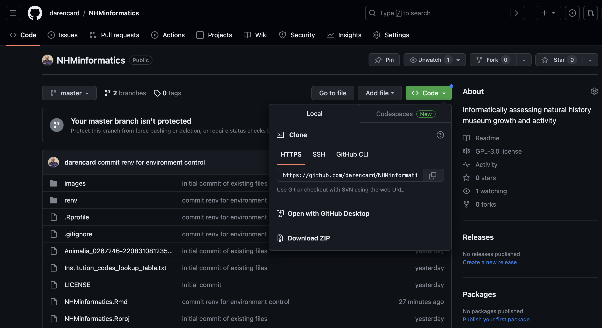
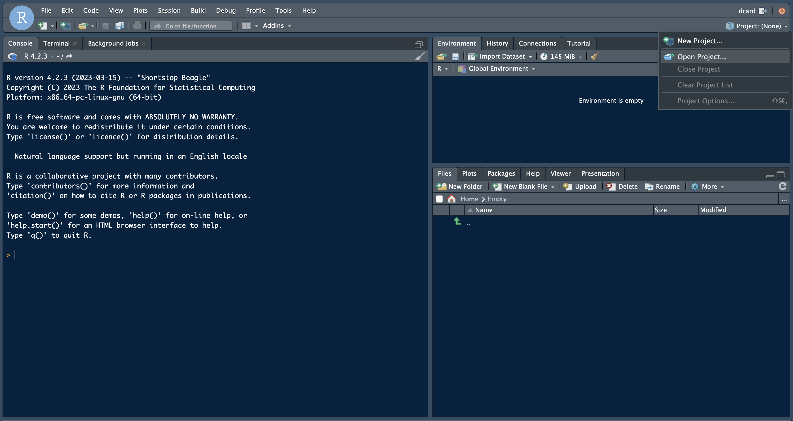
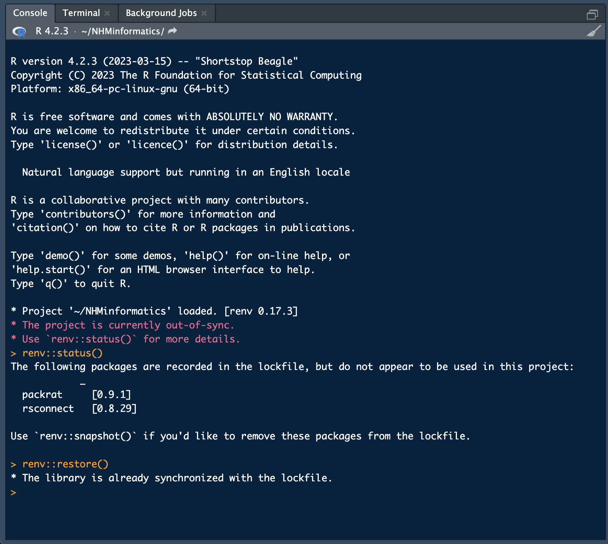
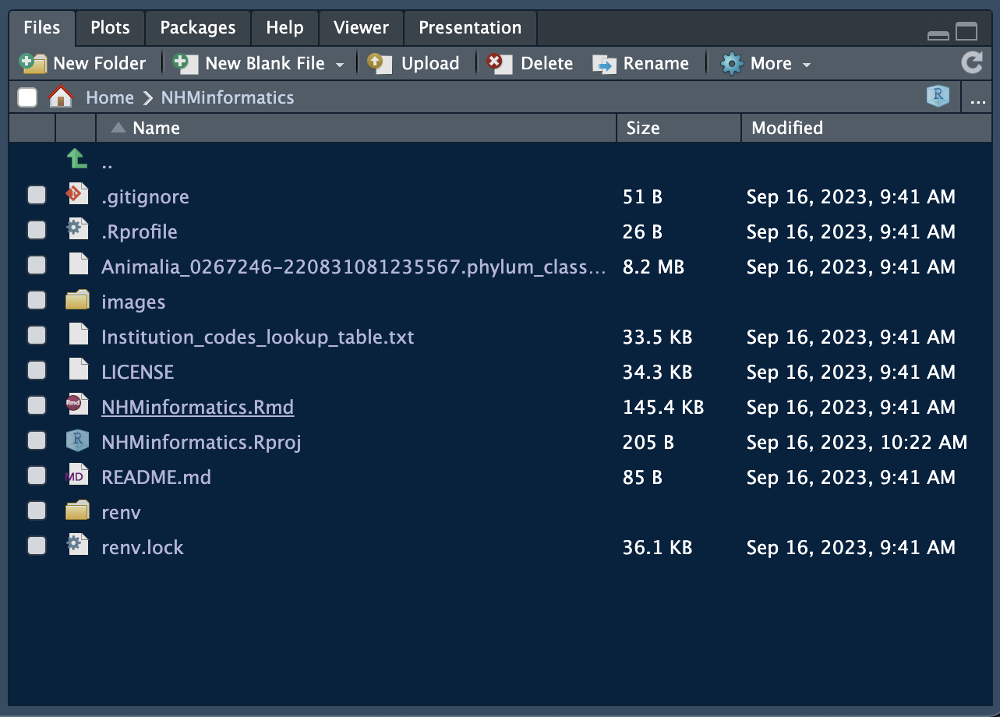
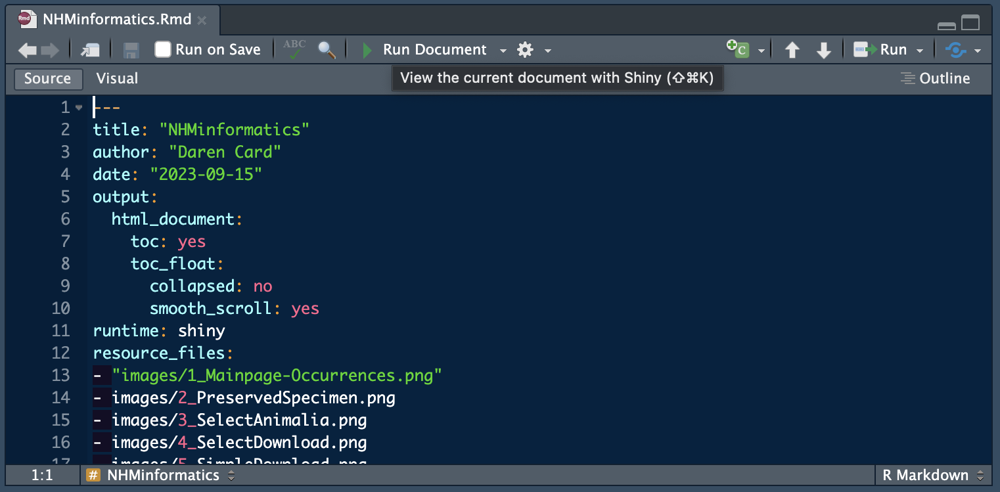
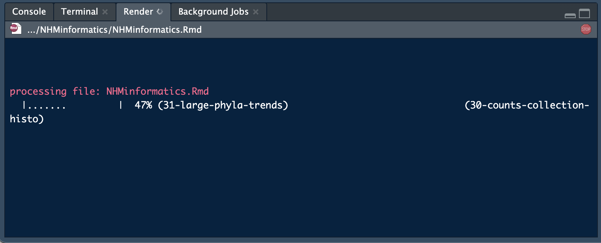
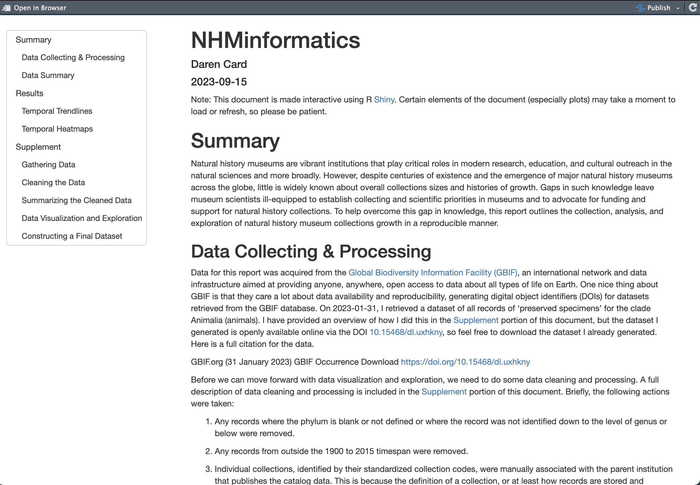

[](https://zenodo.org/badge/latestdoi/692120600)

# NHMinformatics

Informatically assessing natural history museum growth and activity

## Introduction

I used R Shiny to build a simple, interactive application that will allow anyone to explore the filtered, standardized natural history museum data that have been summarized in Card (In Review). In the form of an R Markdown document, this application summarizes the filtered, standardized data and includes embedded Shiny elements that facilitate interactive exploration of these data according to user interests. A detailed supplement with full details – including embedded code, plots, and tables – of retrieving, filtering, and standardizing the raw GBIF data is included. The application also includes an overview of the full exploratory analyses and visualization that formed the basis for this investigation, and all code and documentation necessary to reproduce the analyses and figures presented in this article.

This R Shiny application can be run either locally in your own installed version of R and RStudio or online using a hosted version at [shinyapps.io](https://www.shinyapps.io/). The local option is recommended due to performance advantages but the hosted version is useful if difficulties with the software environment are encountered. Please note that the application can take a few minutes to fully load and can take a few seconds to refresh when user options are changed, so please be patient. I hope to work to optimize the application more, but it should work as-is.

## Running Locally

This GitHub repository has been provisioned with everything that is needed to run the NHMinformatics Shiny markdown document on your own system. The package environment has been captured using `renv`, which facilitates easy setup on diverse systems, at least in theory. Here is a quick-start guide for running NHMinformatics locally.

1. Download this GitHub repository by clicking 'Code' and either selecting 'Download ZIP' or by copying the repository URL and downloading manually using the `git` CLI. If you downloaded the repository as a ZIP, ensure you unzip it first.

```bash
# cd /path/to/working/directory
git clone https://github.com/darencard/NHMinformatics.git
```



2. Next, open RStudio on your local computer. In the top-right corner click on 'Project: (None)' and 'Open Project...'. Normally, you are placed in your `$HOME` directory and you can navigate accordingly. Or select the '...' option in the top-right corner to navigate directory to the path containing the repository. Select `NHMinformatics.Rproj` and click 'Open'. RStudio will now reload with this project loaded (you should now see 'NHMinformatics' where 'Project: (None)' was before).



3. When the project is loaded, `renv` is run to attempt to ensure that all required packages are installed and available. However, I have found that for various reasons, this normally does not complete properly and you may see a warning message posted to the R console after the project is loaded. You can use `renv::status()` to see the status of your environment, which includes important information about missing packages, etc. I find that I normally need to also run `renv::restore()` (followed by `y`) to ensure that all software is properly installed. The screenshot includes an example where everything was already installed, and your results may differ from this. I have tested this myself on a few systems and it seems to work reliably, but your mileage may vary due to non-standard software environments. If you run into issues you cannot overcome, I recommend checking out the hosted version of the application on shinyapps.io.



4. Once the prerequisite software packages are installed, you should now be able to load the application. First, in the Files viewer, click on `NHMinformatics.Rmd` to load the R Markdown file.



5. Once the R Markdown file has loaded, you can click the 'Run Document' at the top of the pane to execute the document. A new window should open (or an internet browser window will open) and will display 'Please wait...' for several minutes while the application loads. You should also notice status updates in the 'Render' tab located near the R 'Console'.





6. After a few minutes, the document/application should render in the open window. It may take another moment or two for the plots to render. Once everything is visible, users can review the document in detail to learn more about how the study was conducted and to explore the data for themselves using some interactive dashboards built using Shiny.



## shinyapps Online

One simply has to navigate to the shinyapps.io URL for the NHMinformatics application at [http://dcard.shinyapps.io/NHMinformatics](http://dcard.shinyapps.io/NHMinformatics). I have found that the performance of shinyapps.io is relatively poor versus running the application locally, so this will take several minutes to fully load.
